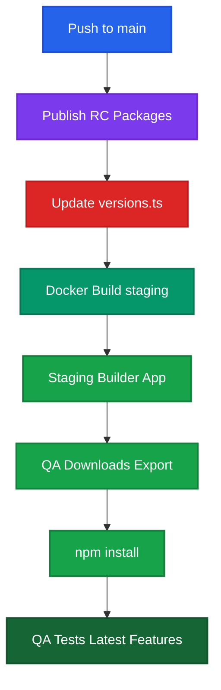
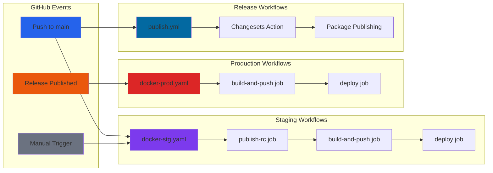

# CI/CD Workflows & Three-Environment System

This document explains the comprehensive CI/CD system for the **Contracts UI Builder** project, including our three-environment strategy and automated workflows.

## 📋 **Table of Contents**

- [Overview](#overview)
- [Three-Environment Strategy](#three-environment-strategy)
- [Workflows](#workflows)
- [RC Publishing Strategy](#rc-publishing-strategy)
- [Transition to Public NPM](#transition-to-public-npm)
- [Visual Flow Diagrams](#visual-flow-diagrams)
- [Troubleshooting](#troubleshooting)

---

## 🎯 **Overview**

The Contracts UI Builder uses a sophisticated CI/CD system that supports three distinct environments, each optimized for different use cases:

- **🏠 Local Development**: For developers working on the codebase
- **🧪 Staging Environment**: For QA testing with latest features
- **🚀 Production Environment**: For end users with stable releases

The system automatically publishes Release Candidate (RC) packages for staging and deploys containerized applications to AWS ECS.

---

## 🏗️ **Three-Environment Strategy**

### Environment Overview

| Environment       | Use Case          | Package Dependencies | Command/Trigger                      |
| ----------------- | ----------------- | -------------------- | ------------------------------------ |
| **🏠 Local**      | Developer testing | `workspace:*`        | `pnpm export-app export --env local` |
| **🧪 Staging**    | QA testing        | `0.0.0-rc-123456`    | Staging UI (auto)                    |
| **🚀 Production** | End users         | `^0.2.1`             | Production UI (auto)                 |

### Package Versioning Strategy

```typescript
// PackageManager.ts logic
if (env === 'local') {
  // Use current monorepo code
  dependencies[pkg] = 'workspace:*';
} else if (env === 'staging') {
  // Use RC versions for testing latest features
  dependencies[pkg] = managedVersion.includes('-rc') ? managedVersion : `${managedVersion}-rc`;
} else {
  // Use stable published versions
  dependencies[pkg] = `^${managedVersion}`;
}
```

---

## ⚙️ **Workflows**

### 1. **Staging Workflow** (`.github/workflows/docker-stg.yaml`)

**Triggers:**

- Push to `main` branch
- Manual workflow dispatch

**Jobs:**

1. **`publish-rc`**: Publishes RC packages for QA testing
2. **`build-and-push`**: Builds and deploys staging Docker image
3. **`deploy`**: Forces ECS service update

**Key Features:**

- Automatic RC version publishing (`0.0.0-rc-123456`)
- Updates `versions.ts` with RC versions
- Docker build with `VITE_EXPORT_ENV=staging`
- Parallel execution for faster deployment

### 2. **Production Workflow** (`.github/workflows/docker-prod.yaml`)

**Triggers:**

- GitHub release published

**Jobs:**

1. **`build-and-push`**: Builds and deploys production Docker image
2. **`deploy`**: Forces ECS service update

**Key Features:**

- Uses stable package versions
- Docker build with `VITE_EXPORT_ENV=production`
- Triggered only on official releases

### 3. **Release Workflow** (`.github/workflows/publish.yml`)

**Triggers:**

- Push to `main` branch

**Features:**

- Manages monorepo versioning with Changesets
- Publishes stable packages to registry
- Creates GitHub releases automatically
- Handles multi-package version coordination

### 4. **AWS OIDC Action** (`.github/actions/oidc/action.yaml`)

**Purpose:**

- Secure authentication to AWS services
- Role-based access via OIDC
- No need for long-lived credentials

---

## 🔄 **RC Publishing Strategy**

The staging environment uses Release Candidate (RC) publishing to ensure QA tests the exact code that will be in the next release.

### RC Publishing Flow



### RC Version Format

RC packages use the format `0.0.0-rc-timestamp` (e.g., `0.0.0-rc-20250807123456`).

**Why 0.0.0?** This is intentional design by Changesets to prevent version conflicts:

- Avoids interference with existing prerelease versions
- Prevents unexpected version resolution in package managers
- Clearly identifies these as temporary snapshot versions
- Follows Changesets' official snapshot versioning strategy

### Benefits of RC Publishing

- ✅ **Consistent Testing**: QA tests exact versions that will be released
- ✅ **No Local Dependencies**: QA doesn't need the full monorepo
- ✅ **Standard npm install**: Works with any Node.js environment
- ✅ **Clear Separation**: 0.0.0 prefix makes it obvious these are test versions

---

## 🌐 **Transition to Public NPM**

Currently using GitHub Package Registry temporarily. Transition plan:

### Current State

```yaml
# .npmrc (temporary)
@openzeppelin:registry=https://npm.pkg.github.com
//npm.pkg.github.com/:_authToken=${NPM_TOKEN}
```

### Future State (Public NPM)

```yaml
# .npmrc (future)
# Standard npm registry - no special configuration needed
```

### Transition Steps

1. **Remove** `Configure npm authentication for private registry` steps from workflows
2. **Update** `.npmrc` to use standard npm registry
3. **Publish** first packages to public npm
4. **Test** RC publishing on public npm
5. **Update** documentation

**Note**: All package names and imports remain identical during transition.

---

## 📊 **Visual Flow Diagrams**

### Complete Three-Environment System

```mermaid
graph TD
    subgraph "Local Development"
        A["pnpm export-app --env local"] --> B["workspace dependencies"]
        B --> C["Latest monorepo code"]
    end

    subgraph "Staging Environment"
        D["Push to main"] --> E["Auto-publish RC packages"]
        E --> F["Docker Build staging"]
        F --> G["Staging Builder exports"]
        G --> H["RC versions in package.json"]
        H --> I["QA npm install"]
    end

    subgraph "Production Environment"
        J["Changesets Release"] --> K["Stable packages"]
        K --> L["Docker Build production"]
        L --> M["Production Builder exports"]
        M --> N["Stable versions in package.json"]
        N --> O["User npm install"]
    end

    style A fill:#3b82f6,stroke:#1d4ed8,stroke-width:2px,color:#ffffff
    style B fill:#3b82f6,stroke:#1d4ed8,stroke-width:2px,color:#ffffff
    style C fill:#1e40af,stroke:#1e3a8a,stroke-width:2px,color:#ffffff

    style D fill:#7c3aed,stroke:#6d28d9,stroke-width:2px,color:#ffffff
    style E fill:#7c3aed,stroke:#6d28d9,stroke-width:2px,color:#ffffff
    style F fill:#059669,stroke:#047857,stroke-width:2px,color:#ffffff
    style G fill:#16a34a,stroke:#15803d,stroke-width:2px,color:#ffffff
    style H fill:#16a34a,stroke:#15803d,stroke-width:2px,color:#ffffff
    style I fill:#166534,stroke:#14532d,stroke-width:2px,color:#ffffff

    style J fill:#ea580c,stroke:#c2410c,stroke-width:2px,color:#ffffff
    style K fill:#0369a1,stroke:#0284c7,stroke-width:2px,color:#ffffff
    style L fill:#15803d,stroke:#166534,stroke-width:2px,color:#ffffff
    style M fill:#15803d,stroke:#166534,stroke-width:2px,color:#ffffff
    style N fill:#15803d,stroke:#166534,stroke-width:2px,color:#ffffff
    style O fill:#166534,stroke:#14532d,stroke-width:2px,color:#ffffff
```



### Workflow Execution Flow



#### Diagram Explanations

**RC Publishing Flow:**

1. **Push to main** → Triggers staging workflow
2. **Publish RC Packages** → Creates versions like `@openzeppelin/adapter-evm@0.0.0-rc-123456`
3. **Update versions.ts** → Contains RC versions for consistent exports
4. **Docker Build staging** → Uses `VITE_EXPORT_ENV=staging`
5. **QA Tests Latest Features** → Standard `npm install` gets RC packages

**Three-Environment System:**

- **Local**: Developers use `workspace:*` for current monorepo code
- **Staging**: QA gets RC packages (`0.0.0-rc-123456`) for testing latest features
- **Production**: Users get stable packages (`^0.2.1`) for reliable deployments

**Workflow Execution:**

- **Blue**: GitHub events that trigger workflows
- **Purple**: Staging processes (RC publishing + deployment)
- **Red**: Production processes (stable deployment)
- **Blue**: Release processes (Changesets versioning)

---

## 🛠️ **Troubleshooting**

### Common Issues

#### 1. **Tests Failing After Version Updates**

- **Problem**: Tests expect specific version numbers
- **Solution**: Tests now use pattern matching (`/^\d+\.\d+\.\d+-rc$/`) instead of hardcoded versions
- **Prevention**: Always use regex patterns for version validation

#### 2. **RC Publishing Fails**

- **Problem**: Changeset version creation fails
- **Diagnosis**: Check if there are pending changesets
- **Solution**:
  ```bash
  pnpm changeset add  # Add changeset if needed
  pnpm changeset version --snapshot rc  # Manual RC creation
  ```

#### 3. **Docker Build Fails**

- **Problem**: Environment variables not passed correctly
- **Check**: Verify `VITE_EXPORT_ENV` is set correctly
- **Staging**: Should be `staging`
- **Production**: Should be `production`

#### 4. **Package Version Mismatch**

- **Problem**: Exported apps use wrong versions
- **Check**: `versions.ts` content after staging deployment
- **Expected**: RC versions in staging, base versions in git
- **Fix**: Re-run `pnpm update-export-versions`

#### 5. **AWS Deployment Issues**

- **Problem**: OIDC authentication fails
- **Check**: Role ARNs in workflow variables
- **Required Variables**:
  - `ROLE_FOR_OIDC`
  - `ROLE_TO_ASSUME`
  - `REGISTRY`
  - `AWS_REGION`

### Debug Commands

```bash
# Check current versions
cat packages/builder/src/export/versions.ts

# Test local export
pnpm export-app export --env local

# Check workflow status
gh workflow list
gh workflow view "Staging Build"

# Verify RC packages (when public)
npm view @openzeppelin/contracts-ui-builder-adapter-evm --tag rc
```

---

## 📚 **Additional Resources**

- **[Changesets Documentation](https://github.com/changesets/changesets)**: Monorepo versioning
- **[AWS OIDC Guide](https://docs.github.com/en/actions/deployment/security-hardening-your-deployments/configuring-openid-connect-in-amazon-web-services)**: Secure deployment setup
- **[Docker Multi-stage Builds](https://docs.docker.com/develop/dev-best-practices/multi-stage-builds/)**: Dockerfile optimization
- **[Vitest Testing](https://vitest.dev/)**: Test framework documentation

---

**🚀 This CI/CD system enables seamless development, comprehensive QA testing, and reliable production deployments while maintaining clear separation between environments and ensuring package version consistency.**
