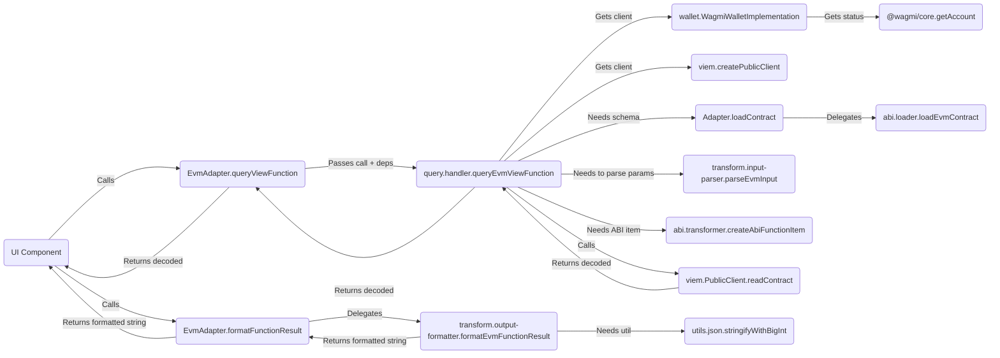

# Adapter Architecture Guide

This document outlines the standardized architecture for blockchain adapters within the Transaction Form Builder project.

## 1. Overview

The goal of the adapter architecture is to provide a consistent, maintainable, and extensible way to integrate support for various blockchain ecosystems. The core principle is **separation of concerns** through a domain-driven modular structure, enforced by the central `ContractAdapter` interface defined in `packages/types`.

Each adapter lives in its own package (e.g., `packages/adapter-evm`, `packages/adapter-solana`) and implements the `ContractAdapter` interface. A key architectural principle is that **adapters are network-aware**. They are instantiated with a specific `NetworkConfig` object (e.g., `EvmNetworkConfig`, `SolanaNetworkConfig`) corresponding to the target network (like Ethereum Mainnet or Solana Devnet). This `networkConfig` is stored internally (usually as `this.networkConfig`) and used by the adapter's methods for all network-dependent operations (e.g., using the correct RPC URL, chain ID, explorer URL).

The main `adapter.ts` file within each package acts as an orchestrator, delegating specific tasks to functions or classes exported from dedicated modules within its `src/` directory.

## 2. Core `ContractAdapter` Interface

All adapters **must** implement the `ContractAdapter` interface found in `packages/types/src/adapters/base.ts`. This interface defines the required methods for:

- Loading contract definitions (e.g., `loadContract`)
- Mapping blockchain types to form field types (e.g., `mapParameterTypeToFieldType`, `getCompatibleFieldTypes`)
- Generating default form fields (e.g., `generateDefaultField`)
- Parsing user input and formatting transaction data (e.g., `formatTransactionData`)
- Signing and broadcasting transactions (e.g., `signAndBroadcast`, `waitForTransactionConfirmation?`)
- Querying view functions (e.g., `isViewFunction`, `queryViewFunction`)
- Formatting query results (e.g., `formatFunctionResult`)
- Handling wallet connections (e.g., `supportsWalletConnection`, `connectWallet`, `disconnectWallet`, `getWalletConnectionStatus`, etc.)
- Providing configuration and metadata (e.g., `getSupportedExecutionMethods`, `validateExecutionConfig`, `getExplorerUrl`, `getExplorerTxUrl?`)
- Basic validation (e.g., `isValidAddress`)

**Note:** Methods requiring network context (like `queryViewFunction`, `getExplorerUrl`, `loadContract` when fetching from network) rely on the `networkConfig` provided during adapter instantiation, rather than receiving it as a parameter.

## 3. Standardized Module Structure

To promote consistency and maintainability, each adapter package should follow this general structure within its `src/` directory:

```plaintext
adapter-<chain>/
└── src/
    ├── adapter.ts             # Main Adapter class implementing ContractAdapter
    ├── networks/              # Network configurations
    │   ├── mainnet.ts         # Specific mainnet NetworkConfig objects
    │   ├── testnet.ts         # Specific testnet NetworkConfig objects
    │   └── index.ts           # Exports all configs + combined list (e.g., evmNetworks)
    ├── [chain-specific-def]/  # e.g., abi/ (EVM), idl/ (Solana), etc.
    │   ├── loader.ts          # Implements `loadContract` logic
    │   ├── [source].ts        # e.g., etherscan.ts (uses NetworkConfig.apiUrl)
    │   └── transformer.ts     # Transforms raw def -> ContractSchema
    │   └── index.ts
    ├── mapping/               # Generic: Type mapping, field generation
    │   ├── constants.ts
    │   ├── type-mapper.ts
    │   └── field-generator.ts
    │   └── index.ts
    ├── transform/             # Generic: Data serialization/deserialization
    │   ├── input-parser.ts
    │   └── output-formatter.ts
    │   └── index.ts
    ├── transaction/           # Generic: Transaction formatting/sending
    │   ├── formatter.ts
    │   └── sender.ts
    │   └── index.ts
    ├── query/                 # Generic: View function querying
    │   ├── handler.ts         # Uses NetworkConfig for RPC/client
    │   └── view-checker.ts
    │   └── index.ts
    ├── wallet/                # Generic: Wallet connection interface logic
    │   ├── connection.ts      # Wraps implementation calls
    │   ├── [impl].ts          # e.g., wagmi-implementation.ts
    │   └── index.ts
    ├── configuration/         # Generic: Metadata/configuration logic
    │   ├── execution.ts
    │   └── explorer.ts        # Uses NetworkConfig for explorer URLs
    │   └── index.ts
    ├── types.ts               # Adapter-specific internal types
    ├── utils/                 # Adapter-specific utils
    │   └── ...
    │   └── index.ts
    └── index.ts               # Main export for the adapter package
```

## 4. Module Responsibilities

- **`adapter.ts`:**

  - Contains the main class (e.g., `EvmAdapter`) that `implements ContractAdapter`.
  - Constructor accepts a specific `NetworkConfig` (e.g., `EvmNetworkConfig`) and stores it.
  - Should be lean, acting primarily as an orchestrator.
  - Instantiates necessary internal classes (like `WagmiWalletImplementation`).
  - Imports functions/classes from other modules.
  - Delegates the implementation of `ContractAdapter` interface methods to the imported functions/classes, passing necessary state (like `this.networkConfig`, `walletImplementation`) or instance methods.

- **`networks/`:**

  - **Purpose:** Defines and exports the specific `NetworkConfig` objects for this adapter's ecosystem (e.g., `ethereumMainnet`, `polygonAmoy`).
  - **Key Exports:** Individual named `NetworkConfig` constants, and a combined array of all configurations (e.g., `evmNetworks`).

- **`[chain-specific-def]/` (e.g., `abi/`, `idl/`):**

  - **Purpose:** Handles loading and parsing the chain's native contract interface definition format (ABI, IDL, etc.) and transforming it into the common `ContractSchema` defined in `packages/types`. May use `networkConfig` (e.g., `apiUrl` for Etherscan).
  - **Key Exports:** A primary function (e.g., `loadEvmContract`) called by `Adapter.loadContract`. Might also export the transformer (e.g., `transformAbiToSchema`).
  - **Flexibility:** This directory name is flexible to reflect the chain's specific definition format.

- **`mapping/`:**

  - **Purpose:** Handles the logic for mapping blockchain-specific parameter types to the standard `FieldType` used by the form builder, determining compatible field types, and generating default `FormFieldType` configurations.
  - **Key Exports:** `map[Chain]ParamTypeToFieldType`, `get[Chain]CompatibleFieldTypes`, `generate[Chain]DefaultField`.

- **`transform/`:**

  - **Purpose:** Handles the serialization and deserialization of data between user-friendly formats (strings, JSON strings) and the formats required by the blockchain/client libraries (e.g., `BigInt`, hex strings, typed objects).
  - **Key Exports:** `parse[Chain]Input`, `format[Chain]FunctionResult`.

- **`transaction/`:**

  - **Purpose:** Contains logic specifically related to preparing and executing state-changing transactions. Uses `networkConfig` for details like Chain ID.
  - **Key Exports:** `format[Chain]TransactionData`, `signAndBroadcast[Chain]Transaction`, `waitFor[Chain]TransactionConfirmation`.

- **`query/`:**

  - **Purpose:** Handles the logic for querying read-only (view/pure) contract functions. Uses `networkConfig` to connect to the correct RPC endpoint.
  - **Key Exports:** `query[Chain]ViewFunction`, `is[Chain]ViewFunction`.

- **`wallet/`:**

  - **Purpose:** Encapsulates all direct interaction with wallet connection libraries (e.g., Wagmi, WalletConnect, Solana Wallet Adapter). May use `networkConfig` to initialize or configure the library.
  - **Key Exports:** `connect[Chain]Wallet`, `disconnect[Chain]Wallet`, `get[Chain]WalletConnectionStatus`, etc.
  - **Internal Implementation:** Often contains a class (e.g., `WagmiWalletImplementation`) that manages the library specifics. The exported functions act as a facade.

- **`configuration/`:**

  - **Purpose:** Provides configuration metadata about the adapter and chain. Uses `networkConfig` for network-specific details like explorer URLs.
  - **Key Exports:** `get[Chain]SupportedExecutionMethods`, `validate[Chain]ExecutionConfig`, `get[Chain]ExplorerAddressUrl`, `get[Chain]ExplorerTxUrl`.

- **`utils/`:**

  - **Purpose:** Contains general utility functions specific to the needs of this adapter (e.g., formatting helpers, JSON helpers).

- **`types.ts`:**

  - **Purpose:** Defines any internal TypeScript types used only within this specific adapter package.

## 5. Data Flow Example (EVM View Query)



## 6. Enforcement & Contribution

- Please refer to this document when developing new adapters or refactoring existing ones.
- The `CONTRIBUTING.md` guide contains steps for adding new adapters following this architecture.
- A scaffolding script (`pnpm create-adapter <chain-name>`) may be available to generate the basic structure.
- Code reviews should verify adherence to this modular structure.
- The `no-extra-adapter-methods` ESLint rule helps enforce interface compliance at the `adapter.ts` level.

By following this structure, we aim for a cleaner, more testable, and easier-to-manage adapter system as the project grows.

## 7. Adapter UI Facilitation Capabilities (Optional)

Beyond the core data and logic operations defined by the `ContractAdapter` interface, adapters can now optionally take on an expanded role to facilitate richer, ecosystem-specific user experiences, particularly for UI interactions within React environments. This approach allows the main application (`core`, `form-renderer`, and exported apps) to leverage advanced UI patterns and libraries (like `wagmi/react` for EVM) without being directly coupled to them.

### 7.1. Rationale

Many blockchain ecosystems have mature libraries that offer not only headless functionalities but also powerful React hooks and UI components for wallet interactions, state management, and data display (e.g., `wagmi/react` and UI kits like RainbowKit for EVM). To enable their use while preserving the chain-agnostic nature of our core packages, the adapter for a specific ecosystem can serve as a gateway, providing these UI enhancements in an abstracted manner.

### 7.2. New Optional Methods on `ContractAdapter`

To support this, the `ContractAdapter` interface (in `packages/types`) can be extended with the following optional methods:

- **`configureUiKit?(config: UiKitConfiguration): void;`**
  - Allows the consuming application to inform the adapter about the desired UI kit (e.g., 'custom', 'rainbowkit') and provide any kit-specific configuration.
- **`getEcosystemReactUiContextProvider?(): React.ComponentType<EcosystemReactUiProviderProps> | undefined;`**
  - Returns a React component that, when rendered, sets up the entire necessary UI context for the adapter's ecosystem. For EVM, this component would internally render `<WagmiProvider>` and, if a third-party kit is configured (Phase 2), it would also compose that kit's provider (e.g., `<RainbowKitProvider>`).
- **`getEcosystemReactHooks?(): EcosystemSpecificReactHooks | undefined;`**
  - Returns an object containing facade React hooks for common wallet and blockchain interactions specific to the ecosystem. For EVM, these facade hooks would internally call `wagmi/react` hooks (e.g., a facade `useAccount` calls `wagmiUseAccount()`). This keeps direct `wagmi/react` imports out of `core` and `form-renderer`.
- **`getEcosystemWalletComponents?(): EcosystemWalletComponents | undefined;`**
  - Returns an object containing standardized, ready-to-use wallet UI components (e.g., `ConnectButton`, `AccountDisplay`). These components are sourced either from the configured third-party UI kit or are basic custom implementations provided by the adapter that use the facade hooks.

(Note: The specific types `UiKitConfiguration`, `EcosystemReactUiProviderProps`, `EcosystemSpecificReactHooks`, and `EcosystemWalletComponents` would be defined in `packages/types`.)

### 7.3. Interaction Pattern

1.  **Configuration**: The main application (`core` or an exported app) initializes the active adapter. The adapter may be configured via its `configureUiKit(config)` method (e.g., by `WalletStateProvider` in `core` based on global settings or defaults) or read its configuration from a service like `AppConfigService` upon instantiation.
2.  **Global Context Setup & State Management (`WalletStateProvider` in `core`)**:
    - The `core` application utilizes an `AdapterProvider` to manage adapter instances (ensuring singletons per network) and a `WalletStateProvider` to manage the globally _active_ network, adapter, and related wallet state.
    - `WalletStateProvider` determines the `activeAdapter` based on the globally selected network.
    - It then calls `activeAdapter.getEcosystemReactUiContextProvider()`. If an adapter-specific UI context provider component is returned (e.g., `EvmBasicUiContextProvider` which includes `WagmiProvider`), `WalletStateProvider` renders this component, wrapping the relevant application tree. This makes the ecosystem-specific context (e.g., `wagmi` context) available app-wide for the facade hooks to function.
    - `WalletStateProvider` also retrieves the `walletFacadeHooks` object by calling `activeAdapter.getEcosystemReactHooks()`.
3.  **Using Hooks and Components via `useWalletState()`:**
    - UI components anywhere in the application (in `core`, `form-renderer`, or exported apps) primarily use a central hook like `useWalletState()`.
    - Through `useWalletState()`, components can access:
      - The `activeAdapter` instance.
      - The `walletFacadeHooks` object (e.g., `useWalletState().walletFacadeHooks`). They then call specific hooks like `walletFacadeHooks.useAccount()` or `walletFacadeHooks.useSwitchChain()`.
      - Other global states like current network ID, connection status, etc., which are themselves often derived within `WalletStateProvider` by calling these facade hooks.
    - To render adapter-specific UI components (like a connect button), a component would typically get the `activeAdapter` via `useWalletState()` and then call `activeAdapter.getEcosystemWalletComponents()`. These retrieved components are expected to internally use `useWalletState()` or the facade hooks for their logic.

This pattern centralizes the management of the active adapter and its UI capabilities, providing a consistent way for components to consume them through a global state hook.

### 7.4. Phased Implementation Example (EVM with `wagmi`)

- **Phase 1 (Foundational)**: The `EvmAdapter` implements these methods to provide a base `<WagmiProvider>` context, a set of essential facade hooks (for account, connect/disconnect, balance, etc.), and basic custom-styled UI components that use these facade hooks.
- **Phase 2 (Third-Party Kits)**: The `EvmAdapter` is enhanced so that `configureUiKit` can accept preferences for kits like RainbowKit. The `getEcosystemReactUiContextProvider` will then compose RainbowKit's provider, and `getEcosystemWalletComponents` will return RainbowKit's components.

### 7.5. Impact on Module Responsibilities (e.g., `wallet/`)

Within an adapter package like `packages/adapter-evm`, the `src/wallet/` directory would be the natural place to house the implementations for:

- The UI context provider component (e.g., `ui-provider.tsx`).
- The facade hooks implementation (e.g., `facade-hooks.ts`).
- The basic custom UI components (e.g., `custom-components.tsx`).

This approach centralizes ecosystem-specific UI logic within the adapter, maintaining a clean separation of concerns and allowing the core application to remain agnostic of the specific libraries used by each adapter for its UI enhancements.
