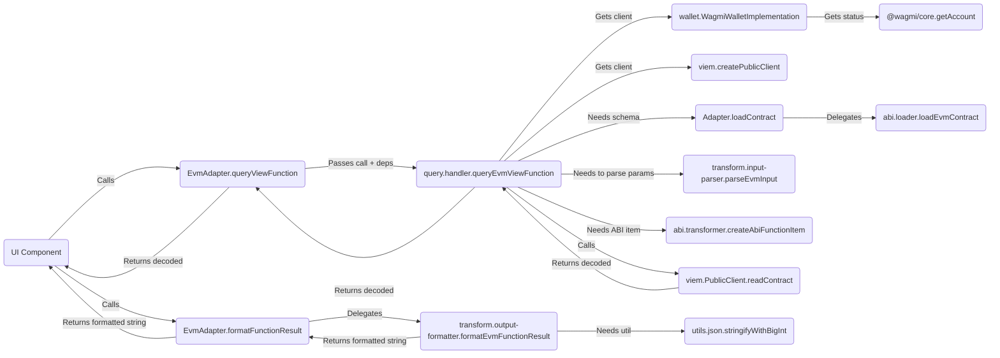

# Adapter Architecture Guide

This document outlines the standardized architecture for blockchain adapters within the Transaction Form Builder project.

## 1. Overview

The goal of the adapter architecture is to provide a consistent, maintainable, and extensible way to integrate support for various blockchain ecosystems. The core principle is **separation of concerns** through a domain-driven modular structure, enforced by the central `ContractAdapter` interface defined in `packages/types`.

Each adapter lives in its own package (e.g., `packages/adapter-evm`, `packages/adapter-solana`) and implements the `ContractAdapter` interface. The main `adapter.ts` file within each package acts as an orchestrator, delegating specific tasks to functions or classes exported from dedicated modules within its `src/` directory.

## 2. Core `ContractAdapter` Interface

All adapters **must** implement the `ContractAdapter` interface found in `packages/types/src/adapters/base.ts`. This interface defines the required methods for:

- Loading contract definitions (e.g., `loadContract`, `loadMockContract`)
- Mapping blockchain types to form field types (e.g., `mapParameterTypeToFieldType`, `getCompatibleFieldTypes`)
- Generating default form fields (e.g., `generateDefaultField`)
- Parsing user input and formatting transaction data (e.g., `formatTransactionData`)
- Signing and broadcasting transactions (e.g., `signAndBroadcast`, `waitForTransactionConfirmation?`)
- Querying view functions (e.g., `isViewFunction`, `queryViewFunction`)
- Formatting query results (e.g., `formatFunctionResult`)
- Handling wallet connections (e.g., `supportsWalletConnection`, `connectWallet`, `disconnectWallet`, `getWalletConnectionStatus`, etc.)
- Providing configuration and metadata (e.g., `getSupportedExecutionMethods`, `validateExecutionConfig`, `getExplorerUrl`, `getExplorerTxUrl?`)
- Basic validation (e.g., `isValidAddress`)

## 3. Standardized Module Structure

To promote consistency and maintainability, each adapter package should follow this general structure within its `src/` directory:

```plaintext
adapter-<chain>/
└── src/
    ├── adapter.ts             # Main Adapter class implementing ContractAdapter
    ├── [chain-specific-def]/  # e.g., abi/ (EVM), idl/ (Solana), etc.
    │   ├── loader.ts          # Implements `loadContract` logic
    │   ├── [source].ts        # e.g., etherscan.ts, on-chain-lookup.ts
    │   └── transformer.ts     # Transforms raw def -> ContractSchema
    │   └── index.ts
    ├── mapping/               # Generic: Type mapping, field generation
    │   ├── constants.ts
    │   ├── type-mapper.ts
    │   └── field-generator.ts
    │   └── index.ts
    ├── transform/             # Generic: Data serialization/deserialization
    │   ├── input-parser.ts
    │   └── output-formatter.ts
    │   └── index.ts
    ├── transaction/           # Generic: Transaction formatting/sending
    │   ├── formatter.ts
    │   └── sender.ts
    │   └── index.ts
    ├── query/                 # Generic: View function querying
    │   ├── handler.ts
    │   └── view-checker.ts
    │   └── index.ts
    ├── wallet/                # Generic: Wallet connection interface logic
    │   ├── connection.ts      # Wraps implementation calls
    │   ├── [impl].ts          # e.g., wagmi-implementation.ts
    │   └── index.ts
    ├── configuration/         # Generic: Metadata/configuration logic
    │   ├── execution.ts
    │   └── explorer.ts
    │   └── index.ts
    ├── mocking/               # Generic: Mock contract loading
    │   ├── loader.ts
    │   └── index.ts
    ├── mocks/                 # Chain-specific mock files (ABIs, IDLs)
    │   └── ...
    ├── types.ts               # Adapter-specific internal types
    ├── utils/                 # Adapter-specific utils
    │   └── ...
    │   └── index.ts
    └── index.ts               # Main export for the adapter package
```

## 4. Module Responsibilities

- **`adapter.ts`:**

  - Contains the main class (e.g., `EvmAdapter`) that `implements ContractAdapter`.
  - Should be lean, acting primarily as an orchestrator.
  - Instantiates necessary internal classes (like `WagmiWalletImplementation`).
  - Imports functions/classes from other modules.
  - Delegates the implementation of `ContractAdapter` interface methods to the imported functions/classes, passing necessary state (like `walletImplementation`) or instance methods (like `this.loadContract`).

- **`[chain-specific-def]/` (e.g., `abi/`, `idl/`):**

  - **Purpose:** Handles loading and parsing the chain's native contract interface definition format (ABI, IDL, etc.) and transforming it into the common `ContractSchema` defined in `packages/types`.
  - **Key Exports:** A primary function (e.g., `loadEvmContract`) called by `Adapter.loadContract`. Might also export the transformer (e.g., `transformAbiToSchema`).
  - **Flexibility:** This directory name is flexible to reflect the chain's specific definition format.

- **`mapping/`:**

  - **Purpose:** Handles the logic for mapping blockchain-specific parameter types to the standard `FieldType` used by the form builder, determining compatible field types, and generating default `FormFieldType` configurations.
  - **Key Exports:** `map[Chain]ParamTypeToFieldType`, `get[Chain]CompatibleFieldTypes`, `generate[Chain]DefaultField`.

- **`transform/`:**

  - **Purpose:** Handles the serialization and deserialization of data between user-friendly formats (strings, JSON strings) and the formats required by the blockchain/client libraries (e.g., `BigInt`, hex strings, typed objects).
  - **Key Exports:** `parse[Chain]Input`, `format[Chain]FunctionResult`.

- **`transaction/`:**

  - **Purpose:** Contains logic specifically related to preparing and executing state-changing transactions.
  - **Key Exports:** `format[Chain]TransactionData`, `signAndBroadcast[Chain]Transaction`, `waitFor[Chain]TransactionConfirmation`.

- **`query/`:**

  - **Purpose:** Handles the logic for querying read-only (view/pure) contract functions.
  - **Key Exports:** `query[Chain]ViewFunction`, `is[Chain]ViewFunction`.

- **`wallet/`:**

  - **Purpose:** Encapsulates all direct interaction with wallet connection libraries (e.g., Wagmi, WalletConnect, Solana Wallet Adapter).
  - **Key Exports:** `connect[Chain]Wallet`, `disconnect[Chain]Wallet`, `get[Chain]WalletConnectionStatus`, etc.
  - **Internal Implementation:** Often contains a class (e.g., `WagmiWalletImplementation`) that manages the library specifics. The exported functions act as a facade.

- **`configuration/`:**

  - **Purpose:** Provides configuration metadata about the adapter and chain.
  - **Key Exports:** `get[Chain]SupportedExecutionMethods`, `validate[Chain]ExecutionConfig`, `get[Chain]ExplorerAddressUrl`, `get[Chain]ExplorerTxUrl`.

- **`mocking/`:**

  - **Purpose:** Handles loading mock contract data for development and testing.
  - **Key Exports:** `load[Chain]MockContract`.

- **`utils/`:**

  - **Purpose:** Contains general utility functions specific to the needs of this adapter (e.g., formatting helpers, JSON helpers).

- **`types.ts`:**

  - **Purpose:** Defines any internal TypeScript types used only within this specific adapter package.

- **`mocks/`:**
  - **Purpose:** Stores mock contract definition files (e.g., JSON ABIs).

## 5. Data Flow Example (EVM View Query)



## 6. Enforcement & Contribution

- Please refer to this document when developing new adapters or refactoring existing ones.
- The `CONTRIBUTING.md` guide contains steps for adding new adapters following this architecture.
- A scaffolding script (`pnpm create-adapter <chain-name>`) may be available to generate the basic structure.
- Code reviews should verify adherence to this modular structure.
- The `no-extra-adapter-methods` ESLint rule helps enforce interface compliance at the `adapter.ts` level.

By following this structure, we aim for a cleaner, more testable, and easier-to-manage adapter system as the project grows.
