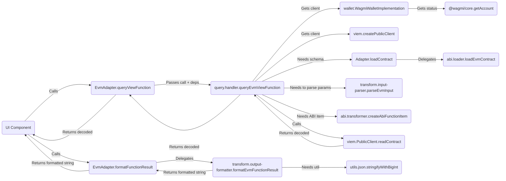

# Adapter Architecture Guide

This document outlines the standardized architecture for blockchain adapters within the Transaction Form Builder project.

## 1. Overview

The goal of the adapter architecture is to provide a consistent, maintainable, and extensible way to integrate support for various blockchain ecosystems. The core principle is **separation of concerns** through a domain-driven modular structure, enforced by the central `ContractAdapter` interface defined in `packages/types`.

Each adapter lives in its own package (e.g., `packages/adapter-evm`, `packages/adapter-solana`) and implements the `ContractAdapter` interface. A key architectural principle is that **adapters are network-aware**. They are instantiated with a specific `NetworkConfig` object (e.g., `EvmNetworkConfig`, `SolanaNetworkConfig`) corresponding to the target network (like Ethereum Mainnet or Solana Devnet). This `networkConfig` is stored internally (usually as `this.networkConfig`) and used by the adapter's methods for all network-dependent operations (e.g., using the correct RPC URL, chain ID, explorer URL).

The main `adapter.ts` file within each package acts as an orchestrator, delegating specific tasks to functions or classes exported from dedicated modules within its `src/` directory.

## 2. Core `ContractAdapter` Interface

All adapters **must** implement the `ContractAdapter` interface found in `packages/types/src/adapters/base.ts`. This interface defines the required methods for:

- Loading contract definitions (e.g., `loadContract`)
- Mapping blockchain types to form field types (e.g., `mapParameterTypeToFieldType`, `getCompatibleFieldTypes`)
- Generating default form fields (e.g., `generateDefaultField`)
- Parsing user input and formatting transaction data (e.g., `formatTransactionData`)
- Signing and broadcasting transactions (e.g., `signAndBroadcast`, `waitForTransactionConfirmation?`)
- Querying view functions (e.g., `isViewFunction`, `queryViewFunction`)
- Formatting query results (e.g., `formatFunctionResult`)
- Handling wallet connections (e.g., `supportsWalletConnection`, `connectWallet`, `disconnectWallet`, `getWalletConnectionStatus`, etc.)
- Providing configuration and metadata (e.g., `getSupportedExecutionMethods`, `validateExecutionConfig`, `getExplorerUrl`, `getExplorerTxUrl?`)
- Basic validation (e.g., `isValidAddress`)

**Note:** Methods requiring network context (like `queryViewFunction`, `getExplorerUrl`, `loadContract` when fetching from network) rely on the `networkConfig` provided during adapter instantiation, rather than receiving it as a parameter.

## 3. Standardized Module Structure

To promote consistency and maintainability, each adapter package should follow this general structure within its `src/` directory:

```plaintext
adapter-<chain>/
└── src/
    ├── adapter.ts             # Main Adapter class implementing ContractAdapter
    ├── networks/              # Network configurations
    │   ├── mainnet.ts         # Specific mainnet NetworkConfig objects
    │   ├── testnet.ts         # Specific testnet NetworkConfig objects
    │   └── index.ts           # Exports all configs + combined list (e.g., evmNetworks)
    ├── [chain-specific-def]/  # e.g., abi/ (EVM), idl/ (Solana), etc.
    │   ├── loader.ts          # Implements `loadContract` logic
    │   ├── [source].ts        # e.g., etherscan.ts (uses NetworkConfig.apiUrl)
    │   └── transformer.ts     # Transforms raw def -> ContractSchema
    │   └── index.ts
    ├── mapping/               # Generic: Type mapping, field generation
    │   ├── constants.ts
    │   ├── type-mapper.ts
    │   └── field-generator.ts
    │   └── index.ts
    ├── transform/             # Generic: Data serialization/deserialization
    │   ├── input-parser.ts
    │   └── output-formatter.ts
    │   └── index.ts
    ├── transaction/           # Generic: Transaction formatting/sending
    │   ├── formatter.ts
    │   └── sender.ts
    │   └── index.ts
    ├── query/                 # Generic: View function querying
    │   ├── handler.ts         # Uses NetworkConfig for RPC/client
    │   └── view-checker.ts
    │   └── index.ts
    ├── wallet/                # Generic: Wallet connection interface logic
    │   ├── connection.ts      # Wraps implementation calls
    │   ├── [impl].ts          # e.g., wagmi-implementation.ts
    │   └── index.ts
    ├── configuration/         # Generic: Metadata/configuration logic
    │   ├── execution.ts
    │   └── explorer.ts        # Uses NetworkConfig for explorer URLs
    │   └── index.ts
    ├── types.ts               # Adapter-specific internal types
    ├── utils/                 # Adapter-specific utils
    │   └── ...
    │   └── index.ts
    └── index.ts               # Main export for the adapter package
```

## 4. Module Responsibilities

- **`adapter.ts`:**
  - Contains the main class (e.g., `EvmAdapter`) that `implements ContractAdapter`.
  - Constructor accepts a specific `NetworkConfig` (e.g., `EvmNetworkConfig`) and stores it.
  - Should be lean, acting primarily as an orchestrator.
  - Instantiates necessary internal classes (like `WagmiWalletImplementation`).
  - Imports functions/classes from other modules.
  - Delegates the implementation of `ContractAdapter` interface methods to the imported functions/classes, passing necessary state (like `this.networkConfig`, `walletImplementation`) or instance methods.

- **`networks/`:**
  - **Purpose:** Defines and exports the specific `NetworkConfig` objects for this adapter's ecosystem (e.g., `ethereumMainnet`, `polygonAmoy`).
  - **Key Exports:** Individual named `NetworkConfig` constants, and a combined array of all configurations (e.g., `evmNetworks`).

- **`[chain-specific-def]/` (e.g., `abi/`, `idl/`):**
  - **Purpose:** Handles loading and parsing the chain's native contract interface definition format (ABI, IDL, etc.) and transforming it into the common `ContractSchema` defined in `packages/types`. (e.g., `abi/` for EVM, handling loading from JSON or Etherscan-compatible explorers using the `apiUrl` from `networkConfig`).
  - **Key Exports:** A primary function (e.g., `loadEvmContract`) called by `Adapter.loadContract`. Might also export the transformer (e.g., `transformAbiToSchema`).
  - **Flexibility:** This directory name is flexible to reflect the chain's specific definition format.

- **`mapping/`:**
  - **Purpose:** Handles the logic for mapping blockchain-specific parameter types to the standard `FieldType` used by the form builder, determining compatible field types, and generating default `FormFieldType` configurations.
  - **Key Exports:** `map[Chain]ParamTypeToFieldType`, `get[Chain]CompatibleFieldTypes`, `generate[Chain]DefaultField`.

- **`transform/`:**
  - **Purpose:** Handles the serialization and deserialization of data between user-friendly formats (strings, JSON strings) and the formats required by the blockchain/client libraries. (e.g., for EVM, this includes parsing JSON strings for array/tuple inputs and serializing `BigInt` values for display).
  - **Key Exports:** `parse[Chain]Input`, `format[Chain]FunctionResult`.

- **`transaction/`:**
  - **Purpose:** Contains all logic related to preparing, signing, and broadcasting state-changing transactions. It uses the **Execution Strategy Pattern** to support multiple submission methods (e.g., EOA, Relayer), making the system extensible.
  - **Key Exports:**
    - `format[Chain]TransactionData`: A function to prepare transaction data from user inputs.
    - `signAndBroadcast[Chain]Transaction`: The main entry point for executing a transaction, which internally uses the strategy pattern.
    - `waitFor[Chain]TransactionConfirmation`: An optional function to await transaction finality.
    - `execution-strategy.ts`: Defines the core `ExecutionStrategy` interface.
    - Strategy implementations like `eoa.ts` and `relayer.ts`.
    - React components for configuring execution method options.

- **`query/`:**
  - **Purpose:** Handles the logic for querying read-only (view/pure) contract functions. Uses `networkConfig` to connect to the correct RPC endpoint.
  - **Key Exports:** `query[Chain]ViewFunction`, `is[Chain]ViewFunction`.

- **`wallet/`:**
  - **Purpose:** Encapsulates all direct interaction with wallet connection libraries (e.g., Wagmi, WalletConnect, Solana Wallet Adapter). (In `adapter-evm`, this module encapsulates `wagmi/core` for all wallet interactions). May use `networkConfig` to initialize or configure the library.
  - **Key Exports:** `connect[Chain]Wallet`, `disconnect[Chain]Wallet`, `get[Chain]WalletConnectionStatus`, etc.
  - **Internal Implementation:** Often contains a class (e.g., `WagmiWalletImplementation`) that manages the library specifics. The exported functions act as a facade.
  - **Note on Non-Standard APIs:** Some wallet APIs may have unconventional connection flows (e.g., returning a promise before user approval is complete). In such cases, the adapter may need to implement creative solutions, such as state-polling, to provide a reliable user experience. The `MidnightAdapter` serves as an example of this pattern.

- **`configuration/`:**
  - **Purpose:** Provides configuration metadata about the adapter and chain. Uses `networkConfig` for network-specific details like explorer URLs.
  - **Key Exports:** `get[Chain]SupportedExecutionMethods`, `validate[Chain]ExecutionConfig`, `get[Chain]ExplorerAddressUrl`, `get[Chain]ExplorerTxUrl`.

- **`utils/`:**
  - **Purpose:** Contains general utility functions specific to the needs of this adapter (e.g., formatting helpers, JSON helpers).

- **`types.ts`:**
  - **Purpose:** Defines any internal TypeScript types used only within this specific adapter package.

## 5. Data Flow Example (EVM View Query)



## 6. The Execution Strategy Pattern

A key architectural feature of the adapter system is the **Execution Strategy pattern**, used to handle different methods of transaction submission (e.g., EOA, Relayer, Multisig). This pattern is implemented within each adapter's `transaction/` module.

### 6.1. Rationale

Instead of creating a monolithic `signAndBroadcast` function with complex conditional logic for each execution method, the pattern decouples the high-level task from the specific implementation details. This makes the system more modular, easier to test, and simpler to extend with new execution methods in the future.

### 6.2. Core Components

1.  **`ExecutionStrategy` Interface**: A common interface (e.g., defined in `src/transaction/execution-strategy.ts`) that all concrete strategy classes must implement. It defines a single, primary method:
    ```typescript
    interface ExecutionStrategy {
      execute(): Promise<TransactionResult>;
      // ...required params: functionId, params, contractAddress, etc.
    }
    ```
2.  **Concrete Strategy Classes**: Separate classes for each execution method, each implementing the `ExecutionStrategy` interface.
    - `EoaExecutionStrategy`: Handles the standard flow of signing and broadcasting a transaction using the user's connected wallet.
    - `RelayerExecutionStrategy`: Implements the logic for sending a transaction to the OpenZeppelin Relayer service, including polling for the final transaction hash.
3.  **Strategy Factory**: A function within the adapter (or its `transaction` module) that takes the user-provided `ExecutionConfig` and returns an instance of the corresponding strategy class.
    ```typescript
    function createExecutionStrategy(config: ExecutionConfig): ExecutionStrategy {
      switch (config.method) {
        case 'eoa':
          return new EoaExecutionStrategy(...);
        case 'relayer':
          return new RelayerExecutionStrategy(...);
        default:
          throw new Error('Unsupported execution method');
      }
    }
    ```

### 6.3. Flow in `Adapter.signAndBroadcast`

The main `signAndBroadcast` method in `adapter.ts` becomes a lean orchestrator:

1.  It receives the `ExecutionConfig` along with other transaction details.
2.  It calls the `createExecutionStrategy` factory to get the appropriate strategy instance.
3.  It calls the `execute()` method on the returned strategy instance.
4.  It returns the result from the strategy's `execute()` method.

This design keeps the main adapter class clean and delegates the complex, method-specific logic to the individual strategy classes, adhering to the single-responsibility principle.

## 7. Runtime Configuration

A robust adapter should allow its network-dependent configurations to be overridden at runtime. This is crucial for flexibility, allowing both the core development environment and exported applications to use custom settings (like private RPC endpoints or API keys) without modifying the adapter's source code.

This project uses a centralized service (`@openzeppelin/transaction-form-utils/appConfigService`) for this purpose.

### 7.1. Pattern

- **Centralized Service**: The `appConfigService` is responsible for loading configuration from different sources:
  - **Vite Environment Variables**: For the core development application (e.g., `VITE_APP_CFG_...`).
  - **`app.config.json`**: For exported, standalone applications.
- **Adapter Integration**: Adapter modules that require configurable values (e.g., the `query` module for RPC URLs or the `abi` module for Etherscan API keys) should use this service to retrieve them.
- **Precedence**: The service provides a clear precedence: a runtime value from the service always overrides the default value hardcoded in the adapter's `NetworkConfig` object.

### 7.2. Example: Resolving an RPC URL

The `resolveRpcUrl` utility in the EVM adapter demonstrates this pattern:

1.  It first asks `appConfigService` for an RPC override for the given network ID.
2.  If an override exists and is valid, it's used.
3.  If not, it falls back to the default `rpcUrl` from the `networkConfig` object passed to the adapter.
4.  If neither is available, it throws an error.

This ensures that developers and end-users have a reliable way to configure critical network parameters.

## 8. Enforcement & Contribution

- Please refer to this document when developing new adapters or refactoring existing ones.
- The `CONTRIBUTING.md` guide contains steps for adding new adapters following this architecture.
- A scaffolding script (`pnpm create-adapter <chain-name>`) may be available to generate the basic structure (TODO: add this)
- Code reviews should verify adherence to this modular structure.
- The `no-extra-adapter-methods` ESLint rule helps enforce interface compliance at the `adapter.ts` level.

By following this structure, we aim for a cleaner, more testable, and easier-to-manage adapter system as the project grows.

## 9. Adapter UI Facilitation Capabilities (Optional)

Beyond core data logic, adapters can facilitate rich, ecosystem-specific UI experiences. This allows the core application to leverage powerful libraries (like `wagmi/react`) without being directly coupled to them.

### 9.1. Rationale

Many blockchain ecosystems have mature libraries offering React hooks and UI components for wallet interactions (e.g., RainbowKit for EVM). To enable their use while preserving chain-agnosticism in the core app, the adapter acts as a gateway, providing these UI enhancements in an abstracted manner.

### 9.2. Case Study: EVM Adapter UI Kit Management

The EVM adapter provides a sophisticated implementation of this pattern to handle different wallet connection UIs (e.g., RainbowKit, a custom modal). This serves as a reference for how other complex adapters could be built.

**Key Components of the Pattern:**

1.  **`EvmUiKitManager` (Singleton)**: This central manager is the brain of the UI system. It is a single instance responsible for:
    - Holding the active `WagmiConfig` object.
    - Managing the state of the selected UI kit (e.g., 'rainbowkit' or 'custom').
    - Triggering the dynamic, lazy-loading of UI kit assets (JavaScript and CSS).
2.  **`EvmWalletUiRoot` (Stable Provider Component)**: The adapter's `getEcosystemReactUiContextProvider` method returns this single, stable component. Its role is to:
    - Subscribe to state changes from the `EvmUiKitManager`.
    - Always render the necessary base providers (`WagmiProvider`, `QueryClientProvider`).
    - Conditionally render the currently active UI kit's specific provider (e.g., `<RainbowKitProvider>`) inside the base providers.
    - This approach prevents the entire React tree from unmounting when the UI kit changes, eliminating UI flicker.
3.  **Asset Managers (`...AssetManager.ts`)**: For each supported UI kit, a dedicated asset manager (e.g., `rainbowkitAssetManager.ts`) is created. Its job is to handle the dynamic `import()` of the third-party library's provider component and its associated CSS. It ensures assets are fetched only once.
4.  **Layered Configuration**: The system uses a layered approach to determine the final UI kit configuration, providing maximum flexibility:
    - **Baseline**: `AppConfigService` provides a baseline configuration from `app.config.json` or environment variables.
    - **User-Native Code**: For complex kits like RainbowKit, the consuming application can provide a native `rainbowkit.config.ts` file, which is dynamically loaded by the adapter via a callback.
    - **Programmatic Override**: The application can call the adapter's `configureUiKit()` method at runtime to override any setting.

This architecture effectively isolates the complexity of managing different UI libraries within the adapter, allowing the core application to simply request the UI components and hooks it needs without knowing the specific implementation details.
