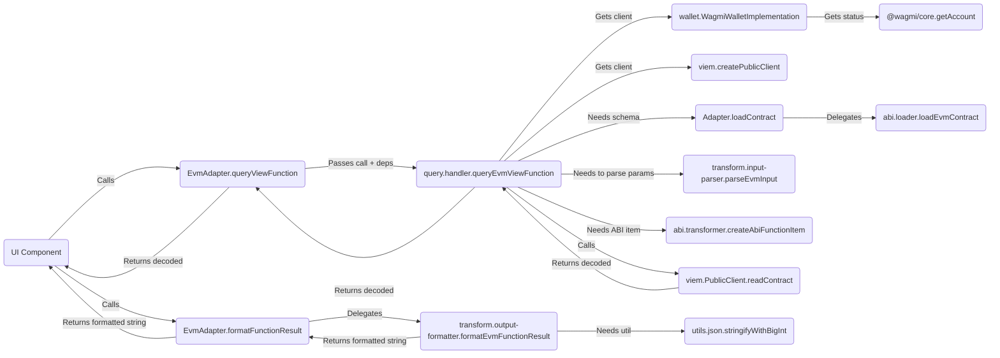

# Adapter Architecture Guide

This document outlines the standardized architecture for blockchain adapters within the UI Builder project.

## 1. Overview

The goal of the adapter architecture is to provide a consistent, maintainable, and extensible way to integrate support for various blockchain ecosystems. The core principle is **separation of concerns** through a domain-driven modular structure, enforced by the central `ContractAdapter` interface defined in `packages/types`.

Each adapter lives in its own package (e.g., `packages/adapter-evm`, `packages/adapter-solana`) and implements the `ContractAdapter` interface. A key architectural principle is that **adapters are network-aware**. They are instantiated with a specific `NetworkConfig` object (e.g., `EvmNetworkConfig`, `SolanaNetworkConfig`) corresponding to the target network (like Ethereum Mainnet or Solana Devnet). This `networkConfig` is stored internally (usually as `this.networkConfig`) and used by the adapter's methods for all network-dependent operations (e.g., using the correct RPC URL, chain ID, explorer URL).

The main `adapter.ts` file within each package acts as an orchestrator, delegating specific tasks to functions or classes exported from dedicated modules within its `src/` directory.

## 2. Core `ContractAdapter` Interface

All adapters **must** implement the `ContractAdapter` interface found in `packages/types/src/adapters/base.ts`. This interface defines the required methods for:

- Loading contract definitions (e.g., `loadContract`)
- Mapping blockchain types to form field types (e.g., `mapParameterTypeToFieldType`, `getCompatibleFieldTypes`)
- Generating default form fields (e.g., `generateDefaultField`)
- Parsing user input and formatting transaction data (e.g., `formatTransactionData`)
- Signing and broadcasting transactions (e.g., `signAndBroadcast`, `waitForTransactionConfirmation?`)
- Querying view functions (e.g., `isViewFunction`, `queryViewFunction`)
- Formatting query results (e.g., `formatFunctionResult`)
- Handling wallet connections (e.g., `supportsWalletConnection`, `connectWallet`, `disconnectWallet`, `getWalletConnectionStatus`, etc.)
- Providing configuration and metadata (e.g., `getSupportedExecutionMethods`, `validateExecutionConfig`, `getExplorerUrl`, `getExplorerTxUrl?`)
- Basic validation (e.g., `isValidAddress`)

**Note:** Methods requiring network context (like `queryViewFunction`, `getExplorerUrl`, `loadContract` when fetching from network) rely on the `networkConfig` provided during adapter instantiation, rather than receiving it as a parameter.

## 3. Standardized Module Structure

To promote consistency and maintainability, each adapter package should follow this general structure within its `src/` directory:

```plaintext
adapter-<chain>/
└── src/
    ├── adapter.ts             # Main Adapter class implementing ContractAdapter
    ├── networks/              # Network configurations
    │   ├── mainnet.ts         # Specific mainnet NetworkConfig objects
    │   ├── testnet.ts         # Specific testnet NetworkConfig objects
    │   └── index.ts           # Exports all configs + combined list (e.g., evmNetworks)
    ├── [chain-specific-def]/  # e.g., abi/ (EVM), idl/ (Solana), etc.
    │   ├── loader.ts          # Implements `loadContract` logic
    │   ├── [source].ts        # e.g., etherscan.ts (uses NetworkConfig.apiUrl)
    │   └── transformer.ts     # Transforms raw def -> ContractSchema
    │   └── index.ts
    ├── mapping/               # Generic: Type mapping, field generation
    │   ├── constants.ts
    │   ├── type-mapper.ts
    │   └── field-generator.ts
    │   └── index.ts
    ├── transform/             # Generic: Data serialization/deserialization
    │   ├── input-parser.ts
    │   └── output-formatter.ts
    │   └── index.ts
    ├── transaction/           # Generic: Transaction formatting/sending
    │   ├── formatter.ts
    │   └── sender.ts
    │   └── index.ts
    ├── query/                 # Generic: View function querying
    │   ├── handler.ts         # Uses NetworkConfig for RPC/client
    │   └── view-checker.ts
    │   └── index.ts
    ├── wallet/                # Generic: Wallet connection interface logic
    │   ├── connection.ts      # Wraps implementation calls
    │   ├── [impl].ts          # e.g., wagmi-implementation.ts
    │   └── index.ts
    ├── configuration/         # Generic: Metadata/configuration logic
    │   ├── execution.ts
    │   └── explorer.ts        # Uses NetworkConfig for explorer URLs
    │   └── index.ts
    ├── types.ts               # Adapter-specific internal types
    ├── utils/                 # Adapter-specific utils
    │   └── ...
    │   └── index.ts
    └── index.ts               # Main export for the adapter package
```

## 4. Module Responsibilities

- **`adapter.ts`:**
  - Contains the main class (e.g., `EvmAdapter`) that `implements ContractAdapter`.
  - Constructor accepts a specific `NetworkConfig` (e.g., `EvmNetworkConfig`) and stores it.
  - Should be lean, acting primarily as an orchestrator.
  - Instantiates necessary internal classes (like `WagmiWalletImplementation`).
  - Imports functions/classes from other modules.
  - Delegates the implementation of `ContractAdapter` interface methods to the imported functions/classes, passing necessary state (like `this.networkConfig`, `walletImplementation`) or instance methods.

- **`networks/`:**
  - **Purpose:** Defines and exports the specific `NetworkConfig` objects for this adapter's ecosystem (e.g., `ethereumMainnet`, `polygonAmoy`).
  - **Key Exports:** Individual named `NetworkConfig` constants, and a combined array of all configurations (e.g., `evmNetworks`).

- **`[chain-specific-def]/` (e.g., `abi/`, `idl/`):**
  - **Purpose:** Handles loading and parsing the chain's native contract interface definition format (ABI, IDL, etc.) and transforming it into the common `ContractSchema` defined in `packages/types`. (e.g., `abi/` for EVM, handling loading from JSON or Etherscan-compatible explorers using the `apiUrl` from `networkConfig`).
  - **Key Exports:** A primary function (e.g., `loadEvmContract`) called by `Adapter.loadContract`. Might also export the transformer (e.g., `transformAbiToSchema`).
  - **Flexibility:** This directory name is flexible to reflect the chain's specific definition format.

- **`mapping/`:**
  - **Purpose:** Handles the logic for mapping blockchain-specific parameter types to the standard `FieldType` used by the builder app, determining compatible field types, and generating default `FormFieldType` configurations.
  - **Key Exports:** `map[Chain]ParamTypeToFieldType`, `get[Chain]CompatibleFieldTypes`, `generate[Chain]DefaultField`.

- **`transform/`:**
  - **Purpose:** Handles the serialization and deserialization of data between user-friendly formats (strings, JSON strings) and the formats required by the blockchain/client libraries. (e.g., for EVM, this includes parsing JSON strings for array/tuple inputs and serializing `BigInt` values for display).
  - **Key Exports:** `parse[Chain]Input`, `format[Chain]FunctionResult`.

- **`transaction/`:**
  - **Purpose:** Contains all logic related to preparing, signing, and broadcasting state-changing transactions. It uses the **Execution Strategy Pattern** to support multiple submission methods (e.g., EOA, Relayer), making the system extensible.
  - **Key Exports:**
    - `format[Chain]TransactionData`: A function to prepare transaction data from user inputs.
    - `signAndBroadcast[Chain]Transaction`: The main entry point for executing a transaction, which internally uses the strategy pattern.
    - `waitFor[Chain]TransactionConfirmation`: An optional function to await transaction finality.
    - `execution-strategy.ts`: Defines the core `ExecutionStrategy` interface.
    - Strategy implementations like `eoa.ts` and `relayer.ts`.
    - React components for configuring execution method options.

- **`query/`:**
  - **Purpose:** Handles the logic for querying read-only (view/pure) contract functions. Uses `networkConfig` to connect to the correct RPC endpoint.
  - **Key Exports:** `query[Chain]ViewFunction`, `is[Chain]ViewFunction`.

- **`wallet/`:**
  - **Purpose:** Encapsulates all direct interaction with wallet connection libraries (e.g., Wagmi, WalletConnect, Solana Wallet Adapter). (In `adapter-evm`, this module encapsulates `wagmi/core` for all wallet interactions). May use `networkConfig` to initialize or configure the library.
  - **Key Exports:** `connect[Chain]Wallet`, `disconnect[Chain]Wallet`, `get[Chain]WalletConnectionStatus`, etc.
  - **Internal Implementation:** Often contains a class (e.g., `WagmiWalletImplementation`) that manages the library specifics. The exported functions act as a facade.
  - **Note on Non-Standard APIs:** Some wallet APIs may have unconventional connection flows (e.g., returning a promise before user approval is complete). In such cases, the adapter may need to implement creative solutions, such as state-polling, to provide a reliable user experience. The `MidnightAdapter` serves as an example of this pattern.

- **`configuration/`:**
  - **Purpose:** Provides configuration metadata about the adapter and chain. Uses `networkConfig` for network-specific details like explorer URLs.
  - **Key Exports:** `get[Chain]SupportedExecutionMethods`, `validate[Chain]ExecutionConfig`, `get[Chain]ExplorerAddressUrl`, `get[Chain]ExplorerTxUrl`.

- **`utils/`:**
  - **Purpose:** Contains general utility functions specific to the needs of this adapter (e.g., formatting helpers, JSON helpers).

- **`types.ts`:**
  - **Purpose:** Defines any internal TypeScript types used only within this specific adapter package.

## 5. Data Flow Example (EVM View Query)



## 6. The Execution Strategy Pattern

A key architectural feature of the adapter system is the **Execution Strategy pattern**, used to handle different methods of transaction submission (e.g., EOA, Relayer, Multisig). This pattern is implemented within each adapter's `transaction/` module.

### 6.1. Rationale

Instead of creating a monolithic `signAndBroadcast` function with complex conditional logic for each execution method, the pattern decouples the high-level task from the specific implementation details. This makes the system more modular, easier to test, and simpler to extend with new execution methods in the future.

### 6.2. Core Components

1.  **`ExecutionStrategy` Interface**: A common interface (e.g., defined in `src/transaction/execution-strategy.ts`) that all concrete strategy classes must implement. It defines a single, primary method:
    ```typescript
    interface ExecutionStrategy {
      execute(): Promise<TransactionResult>;
      // ...required params: functionId, params, contractAddress, etc.
    }
    ```
2.  **Concrete Strategy Classes**: Separate classes for each execution method, each implementing the `ExecutionStrategy` interface.
    - `EoaExecutionStrategy`: Handles the standard flow of signing and broadcasting a transaction using the user's connected wallet.
    - `RelayerExecutionStrategy`: Implements the logic for sending a transaction to the OpenZeppelin Relayer service, including polling for the final transaction hash.
3.  **Strategy Factory**: A function within the adapter (or its `transaction` module) that takes the user-provided `ExecutionConfig` and returns an instance of the corresponding strategy class.
    ```typescript
    function createExecutionStrategy(config: ExecutionConfig): ExecutionStrategy {
      switch (config.method) {
        case 'eoa':
          return new EoaExecutionStrategy(...);
        case 'relayer':
          return new RelayerExecutionStrategy(...);
        default:
          throw new Error('Unsupported execution method');
      }
    }
    ```

### 6.3. Flow in `Adapter.signAndBroadcast`

The main `signAndBroadcast` method in `adapter.ts` becomes a lean orchestrator:

1.  It receives the `ExecutionConfig` along with other transaction details.
2.  It calls the `createExecutionStrategy` factory to get the appropriate strategy instance.
3.  It calls the `execute()` method on the returned strategy instance.
4.  It returns the result from the strategy's `execute()` method.

This design keeps the main adapter class clean and delegates the complex, method-specific logic to the individual strategy classes, adhering to the single-responsibility principle.

## 7. Runtime Configuration

A robust adapter should allow its network-dependent configurations to be overridden at runtime. This is crucial for flexibility, allowing both the core development environment and exported applications to use custom settings (like private RPC endpoints or API keys) without modifying the adapter's source code.

This project uses a centralized service (`@openzeppelin/ui-builder-utils/appConfigService`) for this purpose.

### 7.1. Pattern

- **Centralized Service**: The `appConfigService` is responsible for loading configuration from different sources:
  - **Vite Environment Variables**: For the core development application (e.g., `VITE_APP_CFG_...`).
  - **`app.config.json`**: For exported, standalone applications.
- **Adapter Integration**: Adapter modules that require configurable values (e.g., the `query` module for RPC URLs or the `abi` module for Etherscan API keys) should use this service to retrieve them.
- **Precedence**: The service provides a clear precedence: a runtime value from the service always overrides the default value hardcoded in the adapter's `NetworkConfig` object.

### 7.2. Example: Resolving an RPC URL

The `resolveRpcUrl` utility in the EVM adapter demonstrates this pattern:

1.  It first asks `appConfigService` for an RPC override for the given network ID.
2.  If an override exists and is valid, it's used.
3.  If not, it falls back to the default `rpcUrl` from the `networkConfig` object passed to the adapter.
4.  If neither is available, it throws an error.

This ensures that developers and end-users have a reliable way to configure critical network parameters.

### 7.3. User-Provided RPC Configuration

Just as API keys can be customized, the architecture also allows users to provide their own custom RPC endpoints for any network. This is essential for users who need to connect to private nodes, use paid RPC services for higher reliability, or simply wish to avoid public endpoints.

This feature is implemented using a pattern almost identical to the `appConfigService` override, but is designed for user-facing configuration that is persisted locally in the browser:

1.  **`UserRpcConfigService`**: A dedicated service in `@openzeppelin/ui-builder-utils` that handles saving, retrieving, and managing user-defined RPC endpoints in `localStorage`.
2.  **Adapter Integration**: Each adapter must respect these user-provided endpoints. The `resolveRpcUrl` utility in the EVM adapter is a perfect example of this. It establishes a clear priority for which RPC endpoint to use.
3.  **UI Component**: The `RpcSettingsPanel` in the `packages/ui` library provides a user interface for adding, testing, and saving custom RPC endpoints.

### 7.4. Example: Resolving an RPC URL

The `resolveRpcUrl` utility in the EVM adapter demonstrates a layered approach to ensure maximum flexibility. It resolves the final RPC URL to be used with the following order of precedence:

1.  **User Custom RPC**: It first checks `UserRpcConfigService` for a custom RPC endpoint saved by the user for the current network. If a valid one exists, it is used immediately.
2.  **Application Config Override**: If no user-configured RPC is found, it then checks `appConfigService` for an RPC override (from `app.config.json` or environment variables).
3.  **Default Network RPC**: Finally, if neither of the above is present, it falls back to the default `rpcUrl` hardcoded in the adapter's `NetworkConfig` object.

This layered approach guarantees that user preferences are prioritized, while still providing sensible fallbacks for developers and application deployers.

### 7.5. User-Provided Explorer Configuration

To enhance flexibility and address rate-limiting issues with public API keys, the adapter architecture supports user-configurable block explorer settings. This allows users of the UI Builder—whether in the core development app or an exported application—to provide their own explorer URLs and API keys for each network. This configuration is persisted in the user's browser via `localStorage`.

This system is parallel to the RPC configuration and follows a similar pattern:

1.  **`UserExplorerConfig` Interface**: A standardized interface in `packages/types` defines the shape of a user's custom explorer configuration.
2.  **`UserExplorerConfigService`**: A centralized service in `@openzeppelin/ui-builder-utils` manages the storage and retrieval of these configurations from `localStorage`.
3.  **Adapter-Level Integration**: Each adapter is responsible for handling this user-provided configuration.
    - It must implement `validateExplorerConfig` and `testExplorerConnection` methods on the `ContractAdapter` interface. These functions are used by the UI to allow users to verify their custom settings before saving them.
    - Adapter modules that interact with block explorers (e.g., for fetching contract ABIs or constructing explorer URLs) must be updated to prioritize the user's configuration.
4.  **UI Component**: A dedicated UI component, `ExplorerSettingsPanel` (in `packages/ui`), provides the user interface for inputting and managing these configurations.

**Example: Resolving an Explorer API URL in the EVM Adapter**

The logic for fetching a contract ABI from Etherscan (or a compatible explorer) in the EVM adapter (`packages/adapter-evm/src/abi/etherscan.ts`) exemplifies the pattern:

1.  It first checks if a `UserExplorerConfig` is available for the current network.
2.  If a user config exists and is valid, its `apiUrl` and `apiKey` are used for the request.
3.  If not, it falls back to the default `explorer.apiUrl` and corresponding key (retrieved via `appConfigService`) from the adapter's `NetworkConfig` object.

This layered approach ensures that the application remains functional out-of-the-box while giving advanced users the power to customize its network interactions to suit their needs.

## 8. State Management & Storage Integration

The UI Builder includes a sophisticated state management system and local storage capabilities that work seamlessly with the adapter architecture.

### 8.1. State Management Architecture

The builder application uses a custom state management system built on React's `useSyncExternalStore` for optimal performance:

- **Modular Hook Design**: The monolithic state management has been decomposed into focused, single-responsibility hooks:
  - `useAutoSave`: Handles automatic saving with debouncing and conflict resolution
  - `useBuilderLifecycle`: Manages configuration creation, loading, and deletion
  - `useBuilderContract`: Handles contract schema loading and function selection
  - `useBuilderNetwork`: Manages network selection and adapter coordination
  - `useBuilderNavigation`: Controls wizard step navigation
  - `useBuilderConfig`: Manages UI configuration updates

- **Optimized Subscriptions**: Components use the `useUIBuilderStore` hook to subscribe only to specific state slices, minimizing unnecessary re-renders.
- **Batched Updates**: The central `uiBuilderStore` automatically batches multiple state changes for optimal performance

### 8.2. Storage Integration

The `@openzeppelin/ui-builder-storage` package provides persistent storage for contract UI configurations:

- **IndexedDB Backend**: Uses Dexie.js for robust, performant local storage that works offline
- **Auto-Save System**: Intelligent auto-saving with:
  - Debounced writes to prevent excessive storage operations
  - In-memory caching for performance optimization
  - Global coordination to prevent race conditions and duplicate saves
  - Smart guards to determine when saving is necessary

- **Multi-Tab Synchronization**: Real-time synchronization of configurations across browser tabs
- **Import/Export**: Complete JSON-based import/export system for sharing configurations

### 8.3. Adapter Integration

The storage system integrates seamlessly with the adapter pattern:

- **Chain-Agnostic Storage**: Configurations are stored with ecosystem and network identifiers, allowing the same storage system to work across all supported blockchains
- **Adapter-Aware Restoration**: When loading saved configurations, the appropriate adapter is automatically selected based on the stored ecosystem information
- **Network Configuration Persistence**: Both the selected network and adapter-specific configurations are preserved and restored

For detailed information about the state management architecture, see the [State Management Documentation](../packages/builder/docs/state-management.md).

## 9. Enforcement & Contribution

- Please refer to this document when developing new adapters or refactoring existing ones.
- The `CONTRIBUTING.md` guide contains steps for adding new adapters following this architecture.
- A scaffolding script (`pnpm create-adapter <chain-name>`) may be available to generate the basic structure (TODO: add this)
- Code reviews should verify adherence to this modular structure.
- The `no-extra-adapter-methods` ESLint rule helps enforce interface compliance at the `adapter.ts` level.

By following this structure, we aim for a cleaner, more testable, and easier-to-manage adapter system as the project grows.

## 10. Adapter UI Facilitation Capabilities (Optional)

Beyond core data logic, adapters can facilitate rich, ecosystem-specific UI experiences. This allows the builder application to leverage powerful libraries (like `wagmi/react`) without being directly coupled to them.

### 10.1. Rationale

Many blockchain ecosystems have mature libraries offering React hooks and UI components for wallet interactions (e.g., RainbowKit for EVM). To enable their use while preserving chain-agnosticism in the builder app, the adapter acts as a gateway, providing these UI enhancements in an abstracted manner.

### 10.2. Case Study: EVM Adapter UI Kit Management

The EVM adapter provides a sophisticated implementation of this pattern to handle different wallet connection UIs (e.g., RainbowKit, a custom modal). This serves as a reference for how other complex adapters could be built.

**Key Components of the Pattern:**

1.  **`EvmUiKitManager` (Singleton)**: This central manager is the brain of the UI system. It is a single instance responsible for:
    - Holding the active `WagmiConfig` object.
    - Managing the state of the selected UI kit (e.g., 'rainbowkit' or 'custom').
    - Triggering the dynamic, lazy-loading of UI kit assets (JavaScript and CSS).
2.  **`EvmWalletUiRoot` (Stable Provider Component)**: The adapter's `getEcosystemReactUiContextProvider` method returns this single, stable component. Its role is to:
    - Subscribe to state changes from the `EvmUiKitManager`.
    - Always render the necessary base providers (`WagmiProvider`, `QueryClientProvider`).
    - Conditionally render the currently active UI kit's specific provider (e.g., `<RainbowKitProvider>`) inside the base providers.
    - This approach prevents the entire React tree from unmounting when the UI kit changes, eliminating UI flicker.
3.  **Asset Managers (`...AssetManager.ts`)**: For each supported UI kit, a dedicated asset manager (e.g., `rainbowkitAssetManager.ts`) is created. Its job is to handle the dynamic `import()` of the third-party library's provider component and its associated CSS. It ensures assets are fetched only once.
4.  **Layered Configuration**: The system uses a layered approach to determine the final UI kit configuration, providing maximum flexibility:
    - **Baseline**: `AppConfigService` provides a baseline configuration from `app.config.json` or environment variables.
    - **User-Native Code**: For complex kits like RainbowKit, the consuming application can provide a native `rainbowkit.config.ts` file, which is dynamically loaded by the adapter via a callback.
    - **Programmatic Override**: The application can call the adapter's `configureUiKit()` method at runtime to override any setting.

This architecture effectively isolates the complexity of managing different UI libraries within the adapter, allowing the builder application to simply request the UI components and hooks it needs without knowing the specific implementation details.

## 11. Build-Time Requirements & Configuration

Most adapters require zero build-time configuration—they're pure JavaScript/TypeScript packages that work out-of-the-box with Vite's default settings (e.g., EVM, Stellar). However, some blockchain SDKs have special requirements that necessitate build system configuration.

### 11.1. When Build Configuration is Needed

Adapters may require build-time configuration when their underlying SDK has any of these characteristics:

1. **WASM Modules**: The SDK contains WebAssembly binaries that need special loading
2. **Module Format Issues**: The SDK uses CommonJS in a way that doesn't auto-convert cleanly to ESM
3. **Singleton State**: The SDK relies on global singletons that break if the module is loaded multiple times
4. **Node.js Polyfills**: The SDK expects Node.js globals (Buffer, process, global) in the browser
5. **Top-Level Await**: The SDK uses top-level await for initialization

### 11.2. Principle: Keep It Centralized

**All build configuration must live in `packages/builder/vite.config.ts`**, not scattered across adapter packages. This is because:

- Vite's bundler operates at the **application level**, not package level
- Configuration like `dedupe`, `optimizeDeps`, and global polyfills affects the entire dependency graph
- Developers need one place to understand the complete build pipeline
- Build issues are easier to debug when config is explicit and searchable

**Exception**: Adapters can export Vite plugins for HTML transformations (e.g., injecting polyfills), but these must be explicitly imported and added to the plugins array in the main config.

### 11.3. Case Study: Midnight Adapter

The Midnight adapter serves as the reference implementation for an adapter with complex build requirements. Here's what it needs and why:

#### Required Vite Plugins

```typescript
// packages/builder/vite.config.ts
plugins: [
  wasm(), // Handles .wasm file imports and async loading
  topLevelAwait(), // Supports top-level await in WASM initialization
  // ... other plugins
];
```

**Why**: Midnight SDK packages like `@midnight-ntwrk/compact-runtime` contain WASM binaries that use top-level await for initialization. Without these plugins, imports fail.

#### Module Deduplication

```typescript
dedupe: [
  '@midnight-ntwrk/compact-runtime',
  '@midnight-ntwrk/ledger',
  '@midnight-ntwrk/zswap',
  '@midnight-ntwrk/midnight-js-contracts',
  '@midnight-ntwrk/midnight-js-network-id', // CRITICAL: Singleton
];
```

**Why**: The Midnight SDK uses global singleton state. For example, `@midnight-ntwrk/midnight-js-network-id` exports `setNetworkId()` and `getNetworkId()` functions that maintain a global network identifier. If Vite creates multiple instances of this module (one for the adapter, one dynamically imported during contract evaluation), calls to `setNetworkId()` affect one instance while `getNetworkId()` reads from another, causing "Undeployed" errors.

**Without `dedupe`**: You get module instance fragmentation → broken singleton state.

#### Dependency Pre-Bundling

```typescript
optimizeDeps: {
  include: [
    // Force ESM conversion
    '@midnight-ntwrk/compact-runtime',
    '@midnight-ntwrk/ledger',
    // ... and their CommonJS dependencies
    'protobufjs',
    'object-inspect',
  ],
  exclude: [
    // Don't pre-bundle packages with WASM
    '@midnight-ntwrk/onchain-runtime',
  ]
}
```

**Why**: The Midnight SDK is published as CommonJS, but Vite and modern browsers expect ESM. Pre-bundling forces esbuild to convert these packages to ESM format during dev server startup. The `exclude` list prevents pre-bundling of packages that contain WASM, as they must be handled by `vite-plugin-wasm` at runtime.

#### Buffer Polyfill

The Midnight SDK requires `Buffer` in the browser (used by `@dao-xyz/borsh` for binary serialization). Two approaches:

1. **Runtime Polyfill** (Current): The adapter's `browser-init.ts` provides a minimal `Buffer` polyfill that's loaded before any SDK code
2. **Build-Time Plugin** (Removed as redundant): `@esbuild-plugins/node-globals-polyfill` was tested but found unnecessary since runtime polyfill loads first

### 11.4. Documentation Requirements

When adding an adapter that requires build configuration:

1. **Add section markers** in `vite.config.ts` clearly labeling adapter-specific config:

   ```typescript
   // ============================================================================
   // [ADAPTER NAME]: [Configuration Type]
   // ============================================================================
   // Explanation of why this is needed
   ```

2. **Update this section** (`§ 11`) with:
   - A brief summary of what the adapter needs
   - Why each piece of configuration is required
   - What breaks if the configuration is removed

3. **Document in adapter's README**: Link back to this architecture doc and explain that build configuration is in `packages/builder/vite.config.ts`

### 11.5. Testing Build Configuration

Before committing build configuration changes:

1. **Test removal**: Comment out the config and verify what actually breaks
2. **Test dev mode**: `pnpm dev` - ensure hot reload works
3. **Test build**: `pnpm build` - ensure production builds succeed
4. **Test the adapter**: Execute a transaction using the adapter in dev mode
5. **Clear cache**: `rm -rf packages/builder/node_modules/.vite` between tests

### 11.6. Including Adapter Artifacts in Exported Apps

Some adapters need to bundle ecosystem-specific artifacts into exported applications to enable offline transaction execution. The Midnight adapter, for example, bundles ZK proof artifacts, contract modules, and witness code.

#### 11.6.1. Architecture

The artifact bundling system is **adapter-led** and **chain-agnostic**:

1. **Adapter Interface Extension**: Adapters can implement the optional `getExportBootstrapFiles()` method
2. **Export Pipeline Integration**: The export system automatically calls this method and includes returned files
3. **Template Injection**: Bootstrap imports and initialization code are injected into the exported app's `main.tsx`
4. **Zero Impact on Other Adapters**: Non-participating adapters (EVM, Stellar) are unaffected

#### 11.6.2. Implementing in an Adapter

To bundle artifacts in your adapter:

**Step 1: Implement `getExportBootstrapFiles()`**

```typescript
// packages/adapter-yourchain/src/export/bootstrap.ts
import type { AdapterExportBootstrap, AdapterExportContext } from '@openzeppelin/ui-builder-types';

export async function getYourChainExportBootstrapFiles(
  context: AdapterExportContext
): Promise<AdapterExportBootstrap | null> {
  // Extract artifacts from context
  const artifacts = context.artifacts;
  const definitionOriginal = context.definitionOriginal;

  if (!artifacts || !definitionOriginal) {
    return null; // No artifacts to bundle
  }

  // Generate artifact file content
  const artifactsFileContent = `
    export const yourChainArtifacts = {
      address: '${context.formConfig.contractAddress}',
      // ... your artifact structure
    };
  `;

  return {
    files: {
      'src/yourchain/artifacts.ts': artifactsFileContent,
    },
    imports: ["import { yourChainArtifacts } from './yourchain/artifacts';"],
    initAfterAdapterConstruct: `
      // Preload artifacts into adapter
      if (typeof (adapter as any).loadContractWithMetadata === 'function') {
        await (adapter as any).loadContractWithMetadata(yourChainArtifacts);
      }
    `,
  };
}
```

**Step 2: Wire into Adapter**

```typescript
// packages/adapter-yourchain/src/adapter.ts
import { getYourChainExportBootstrapFiles } from './export/bootstrap';

export class YourChainAdapter implements ContractAdapter {
  // ... existing methods

  public async getExportBootstrapFiles(
    context: AdapterExportContext
  ): Promise<AdapterExportBootstrap | null> {
    return getYourChainExportBootstrapFiles(context);
  }
}
```

#### 11.6.3. What Happens During Export

1. **Export Pipeline** (`AppExportSystem.ts`):
   - Pulls artifacts from builder state: `contractState.contractDefinitionArtifacts` and `contractState.definitionOriginal`
   - Passes them to the assembler via `exportOptions.adapterArtifacts`

2. **Assembler** (`generateAdapterBootstrapFiles.ts`):
   - Checks if adapter implements `getExportBootstrapFiles()`
   - Calls it with context (formConfig, contractSchema, networkConfig, artifacts)
   - Adds returned files to the project
   - Returns bootstrap info for template injection

3. **Template Injection** (`AppExportSystem.injectBootstrapCode()`):
   - Injects imports after `import './styles.css';` in `main.tsx`
   - Injects initialization code after adapter construction in `resolveAdapter()`

#### 11.6.4. Exported App Structure

For a Midnight export, the generated app includes:

```
exports/your-app/
├── src/
│   ├── midnight/
│   │   └── artifacts.ts          # ← Bundled artifacts
│   ├── main.tsx                   # ← With injected imports/init
│   ├── App.tsx
│   └── components/
│       └── GeneratedForm.tsx
├── package.json
└── vite.config.ts
```

The `main.tsx` will contain:

```typescript
import './styles.css';

import { midnightArtifacts } from './midnight/artifacts'; // ← Injected

const resolveAdapter = async (nc: NetworkConfig): Promise<ContractAdapter> => {
  if (nc.id === exportedNetworkConfig.id) {
    const adapter = new MidnightAdapter(nc as typeof exportedNetworkConfig);
    // Preload Midnight contract artifacts into adapter
    if (typeof (adapter as any).loadContractWithMetadata === 'function') {
      await (adapter as any).loadContractWithMetadata(midnightArtifacts); // ← Injected
    }
    return adapter;
  }
  // ...
};
```

#### 11.6.5. Midnight Adapter Case Study

The Midnight adapter uses a **lean bundling approach** that keeps exported files small:

**What Gets Bundled:**

- ✅ **Original ZIP file** (base64-encoded)
- ✅ **Contract address** and **private state ID**

**What Gets Parsed at Runtime:**

- Contract definition (TypeScript `.d.ts`)
- Contract module (`.cjs`)
- Witness code (`witnesses.js`)
- Verifier keys (`.prover`/`.verifier`)
- ZK artifacts for proof generation

**Implementation:** `packages/adapter-midnight/src/export/bootstrap.ts`

```typescript
export const midnightArtifactsSource = {
  contractAddress: '0x...',
  privateStateId: 'counter',
  contractArtifactsZip: 'UEsDBBQAA...', // base64 ZIP data
};
```

The adapter's `loadContractWithMetadata` method receives this object and:

1. Extracts the ZIP file (same logic as builder upload)
2. Parses all artifacts from the ZIP
3. Registers ZK proof files with the global provider
4. Returns the parsed contract schema

**Benefits:**

- ✅ **Small export size**
- ✅ **Code reuse** (same ZIP parsing logic as builder)
- ✅ **Maintainable** (single source of truth for parsing)
- ✅ **Future-proof** (ZIP format changes don't require export updates)

These artifacts enable:

- ✅ Offline transaction execution (no network fetch)
- ✅ ZK proof generation in the browser
- ✅ Contract state queries via the indexer
- ✅ Full transaction functionality without runtime artifact loading

#### 11.6.6. Testing

1. **Export a Midnight app** from the builder with a loaded contract
2. **Check for artifacts file**: `exports/your-app/src/midnight/artifacts.ts`
3. **Verify main.tsx injection**: Look for import and init code
4. **Run the exported app**: `cd exports/your-app && npm install && npm run dev`
5. **Execute a transaction**: Confirm it works without runtime artifact loading

### 11.7. Future: Exported Applications (Historical Note)

When users export applications built with the UI Builder, build configuration requirements follow them:

- The export template (`packages/builder/src/export/templates/`) includes its own `vite.config.ts`
- Adapter-specific configuration is conditionally included in exported configs based on which adapter is used
- **Update (2025)**: Adapter artifact bundling is now implemented via `getExportBootstrapFiles()` (see § 11.6)

## 12. Architecture Boundaries & Constitution

All adapter work must comply with the project constitution. Read it before implementing or modifying adapters:

- [../.specify/memory/constitution.md](../.specify/memory/constitution.md)

Key non‑negotiables for adapters (summary):

- Chain‑agnostic core: All chain‑specific code, polyfills, and dependencies belong only in `packages/adapter-*`.
- EVM adapter is the architectural template; mirror its structure, naming, and patterns.
- Implement `ContractAdapter` exactly; do not add extra public methods beyond the interface.
- Adapters are network‑aware (constructed with a `NetworkConfig` and must use it internally).
- Use shared types from `packages/types` as the single source of truth.
- Validation: `isValidAddress(address: string, addressType?: string)` is the single validation entrypoint.
- No `console` in libraries; use the shared `logger` with default‑disabled logging outside development.
- UI consistency: follow Tailwind v4 + shadcn/ui, `cn` utility, and `lucide-react` icons.
- Contract comparisons must use raw definitions (ABI/IDL/etc.), not internal `ContractSchema`.
