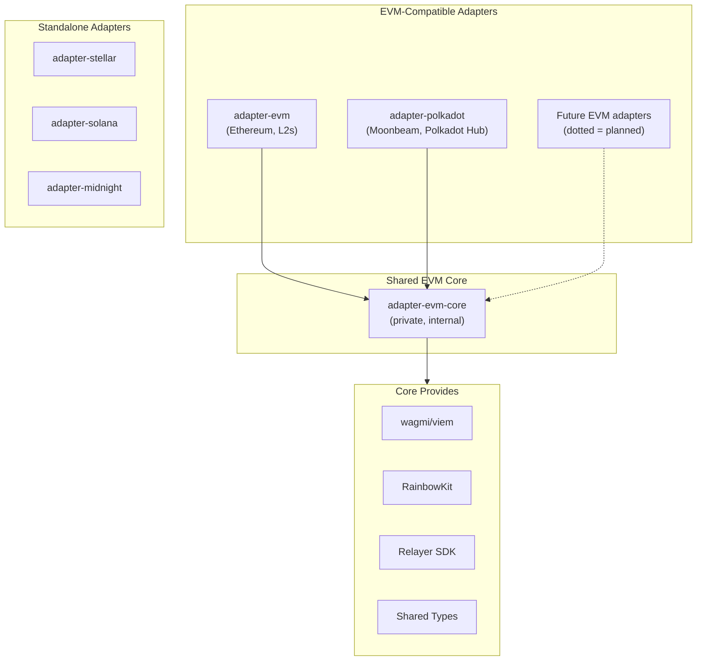

# Adapter Architecture

This document explains the dependency structure of UI Builder's blockchain adapters.

## Overview

UI Builder uses an adapter pattern to support multiple blockchain ecosystems. Each adapter implements the `ContractAdapter` interface and provides chain-specific functionality for:

- Loading and parsing contract definitions (ABIs, IDLs, etc.)
- Executing transactions
- Querying contract state
- Wallet connection and management

## Dependency Structure

## Package Details

### EVM Core (`adapter-evm-core`)

| Property  | Value                             |
| --------- | --------------------------------- |
| Published | No (internal workspace package)   |
| Consumers | `adapter-evm`, `adapter-polkadot` |

Provides shared functionality for all EVM-compatible chains:

- **ABI Module**: Loading, transformation, and comparison
- **Transaction Module**: Execution strategies (EOA, Relayer)
- **Wallet Module**: wagmi/viem integration, RainbowKit configuration
- **Configuration Module**: RPC and explorer resolution
- **Validation Module**: Execution config validation

### EVM Adapter (`adapter-evm`)

| Property   | Value                                        |
| ---------- | -------------------------------------------- |
| Published  | Yes (`@openzeppelin/ui-builder-adapter-evm`) |
| Depends on | `adapter-evm-core`                           |

Primary adapter for Ethereum and EVM L2 chains (Polygon, Arbitrum, Optimism, Base, etc.).

### Polkadot Adapter (`adapter-polkadot`)

| Property   | Value                                             |
| ---------- | ------------------------------------------------- |
| Published  | Yes (`@openzeppelin/ui-builder-adapter-polkadot`) |
| Depends on | `adapter-evm-core`                                |

Adapter for Polkadot ecosystem chains with EVM compatibility:

- Moonbeam / Moonriver
- Polkadot Asset Hub (via EVM precompiles)

### Standalone Adapters

These adapters do **not** depend on `adapter-evm-core` and use their own chain-specific SDKs:

| Adapter            | SDK                                                       |
| ------------------ | --------------------------------------------------------- |
| `adapter-stellar`  | `@stellar/stellar-sdk`, `@creit.tech/stellar-wallets-kit` |
| `adapter-solana`   | `@solana/web3.js`, `@solana/wallet-adapter-*`             |
| `adapter-midnight` | `@midnight-ntwrk/*`                                       |

## Adding New Adapters

### For EVM-Compatible Chains

1. Create `packages/adapter-<name>/`
2. Add **devDependency**: `"@openzeppelin/ui-builder-adapter-evm-core": "workspace:*"` (must be in devDependencies, not dependencies, since it's bundled)
3. Configure `tsup.config.ts` with `noExternal: ['@openzeppelin/ui-builder-adapter-evm-core']` to bundle the core code
4. Implement adapter using core modules
5. Define network configurations

See [adapter-polkadot](./adapter-polkadot/) as a reference implementation.

### For Non-EVM Chains

1. Create `packages/adapter-<name>/`
2. Add chain-specific SDK dependencies
3. Implement the full `ContractAdapter` interface
4. Define network configurations and wallet integration

See [adapter-stellar](./adapter-stellar/) as a reference implementation.
