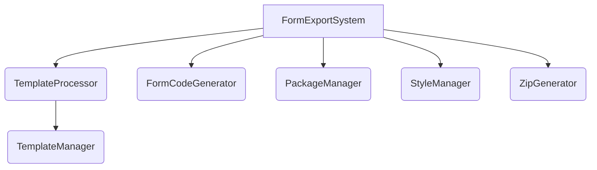

# Transaction Form Builder - Export System

## Overview

The Export System is a key component of the Transaction Form Builder that allows users to export customized blockchain transaction forms as standalone applications. It generates complete, ready-to-use React applications that implement the user's form configuration using the shared form-renderer package.

## Architecture

The export system follows a modular architecture with several specialized components:



### Key Components

1.  **FormExportSystem**: The main orchestrator that coordinates the entire export process.
2.  **FormCodeGenerator**: Generates React components (`main.tsx`, `App.tsx`, `GeneratedForm.tsx`) using code templates and the user's configuration.
3.  **TemplateManager**: Manages base project template files (structure, static assets, placeholder components).
4.  **TemplateProcessor**: Processes code templates with placeholder substitution and formatting.
5.  **PackageManager**: Manages dependencies for the exported project (builder, adapter, form-renderer).
6.  **ZipGenerator**: Creates a downloadable ZIP file of the project.
7.  **StyleManager**: Gathers necessary shared CSS files (`global.css`) and configuration files (`tailwind.config.cjs`, `postcss.config.cjs`, `components.json`) for inclusion in the export.

## Schema Transformation

The export system uses the FormSchemaFactory's `builderConfigToRenderSchema` method to ensure consistency between form preview and export. This transformation:

1. Converts the builder configuration (BuilderFormConfig) to a render schema (RenderFormSchema)
2. Ensures all required properties are present (id, title, submitButton, etc.)
3. Provides uniform behavior between preview and exported forms

A validation step verifies that all required schema properties are present before code generation, preventing potential runtime errors in exported forms.

## Export Process Flow

1.  User initiates export with a form configuration, chain type, and function ID.
2.  `FormCodeGenerator` creates the content for `main.tsx`, `App.tsx`, and `GeneratedForm.tsx` using code templates.
3.  `TemplateManager` creates a base project structure from a template (e.g., `typescript-react-vite`), excluding files that will be generated (like `main.tsx`).
4.  `StyleManager` retrieves shared CSS and root config file content.
5.  `FormExportSystem` assembles the final project files:
    - Copies base template files.
    - Adds the generated `main.tsx`, `App.tsx`, `GeneratedForm.tsx` (overwriting placeholders like the base `App.tsx`).
    - Adds shared styles and configs.
    - Modifies `tailwind.config.cjs` content paths.
6.  `PackageManager` updates the `package.json` content with merged dependencies and metadata.
7.  `TemplateProcessor` formats JSON files.
8.  `ZipGenerator` bundles everything into a downloadable ZIP file.
9.  The completed ZIP is returned to the user.

## Template System

The template system uses real code files as templates instead of string literals, providing several benefits:

1. **IDE Support**: Full syntax highlighting, error checking, and auto-completion during development
2. **Maintainability**: Templates are actual TypeScript/React files, not string literals
3. **Type Safety**: Templates use TypeScript interfaces for parameters

### Template Files

Templates are stored in two locations:

- `/codeTemplates`: Contains templates for dynamically generated files (`main.template.tsx`, `app-component.template.tsx`, `form-component.template.tsx`).
- `/templates`: Contains base project structure templates (e.g., `typescript-react-vite`) including placeholder components and static files.

### Placeholder Syntax

Templates use a consistent placeholder syntax:

1. **Regular Placeholders**: `@@param-name@@`
2. **JSX Comment Placeholders**: `{/*@@param-name@@*/}`
3. **Inline Comment Placeholders**: `/*@@param-name@@*/`

Example:

```tsx
// Title with regular placeholder
<h2>Transaction Form for @@function-id@@</h2>

// JSX placeholder for React component
import { {/*@@adapter-class-name@@*/} } from '../adapters/@@ecosystem@@/adapter';

// Inline comment placeholder
const adapter = new /*@@adapter-class-name@@*/();
```

## Code Generation

The code generation system (`FormCodeGenerator`) produces the content for:

1.  **`main.tsx`**: The application entry point, initializing the adapter.
2.  **`App.tsx`**: The main application component, passing the adapter down.
3.  **`GeneratedForm.tsx`**: The specific form component rendering the UI using `form-renderer`.

### Form Component Generation

The FormCodeGenerator creates a form component that:

- Imports the TransactionForm component from the form-renderer package
- Uses the appropriate blockchain adapter
- Includes the form schema with all fields and validation
- Handles form submission and error states

## Package Management

The PackageManager handles dependency management for exported projects:

1. **Core Dependencies**: Always included (React, form-renderer package)
2. **Chain-specific Dependencies**: Based on the selected blockchain (ethers for EVM, etc.)
3. **Field-specific Dependencies**: Based on the field types used in the form

Configurations are loaded automatically at build time from:

- `/adapters/*/config.ts`: For chain-specific dependencies
- `/form-renderer/src/config.ts`: For field-specific dependencies

## Export Options

The export system supports various options:

- **template**: Template to use (default: 'typescript-react-vite')
- **projectName**: Custom name for the project
- **description**: Project description
- **includeAdapters**: Whether to include adapter files (default: true)
- **onProgress**: Callback for progress updates during export

## Usage

```typescript
const exportSystem = new FormExportSystem();

// Export a form
const result = await exportSystem.exportForm(
  formConfig, // Form configuration from the builder
  'evm', // Chain type
  'transferTokens', // Function ID
  {
    projectName: 'My Token Transfer Form',
    description: 'A form for transferring ERC20 tokens',
  }
);

// Result contains:
// - data: The generated ZIP file blob/buffer
// - fileName: Suggested filename for the ZIP
// - dependencies: List of dependencies used
```

## Adding New Templates

To add a new template:

1. Create a new directory in `/templates` (e.g., `/templates/typescript-next-app`)
2. Add all necessary files for a working project
3. Use placeholder syntax where dynamic content is needed
4. Update template documentation

## Adding New Blockchain Support

To support a new blockchain:

1. Create a new adapter implementation in `/adapters/your-chain`
2. Create a configuration file at `/adapters/your-chain/config.ts`
3. Define runtime and development dependencies in the config
4. Add adapter-specific template modifications if needed

## Testing

The export system includes comprehensive testing:

- Unit tests for individual components
- Integration tests for the complete export process
- Mock configurations for testing different scenarios

Run tests with:

```bash
pnpm test:export
```

## Troubleshooting

Common issues:

1. **Missing dependencies**: Check adapter and form-renderer configurations
2. **Template not found**: Ensure the template exists in the templates directory
3. **Export failures**: Check console for detailed error messages

## Future Enhancements

Planned improvements:

- Support for more project templates (Next.js, Vue, etc.)
- Advanced customization options (theme, styling, etc.)
- Framework-specific adapter optimizations
- Live preview of exported projects

## Virtual Module Loading

To reliably load files outside the `packages/builder` scope (like root configs or shared styles)
across different execution environments (Vite dev, Vite build, Vitest), we use custom Vite plugins:

- **`vite-plugins/virtual-content-loader.ts`**: Loads the raw text content of specified files
  (configs, shared CSS, template CSS) using `fs.readFileSync` during the build/test setup
  and makes it available via `virtual:` imports (e.g., `virtual:tailwind-config-content`).
- **`vite-plugins/cross-package-provider.ts`**: Handles virtual modules that need to import _code_
  from other packages (like `virtual:form-renderer-config`) by generating intermediate modules
  that use Vite aliases.

Type definitions for these virtual modules are in `src/types/virtual-modules.d.ts`.
Mock implementations for tests are provided via a plugin in `vitest.config.ts`.
