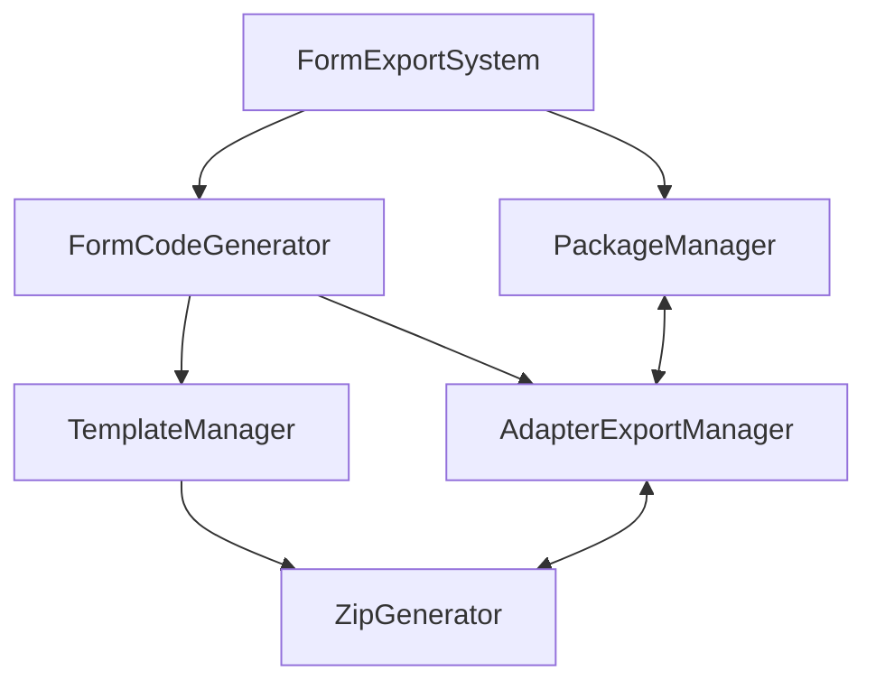

# Code Generation and Export Architecture

This document describes the architecture of the code generation and export system in the Transaction Form Builder project. The export system enables users to create standalone form applications for blockchain transactions based on customized form configurations.

## System Overview

The code generation and export system follows a modular architecture with specialized components that work together to generate and package form applications. The system is designed to be:

- **Browser-compatible**: All operations are performed in-memory without requiring server-side processing
- **Chain-agnostic**: Supports multiple blockchain ecosystems through adapters
- **Extendable**: New blockchain adapters and templates can be added without modifying the core system
- **Type-safe**: Leverages TypeScript for type safety across the export pipeline



## Core Components

### FormExportSystem

`FormExportSystem` is the main entry point for the export process, orchestrating all other components to generate a complete project:

- Coordinates the entire export pipeline
- Handles error management and progress tracking
- Configures export options based on user preferences
- Produces the final ZIP file for download

```typescript
// Example usage
const exportSystem = new FormExportSystem();
const result = await exportSystem.exportForm(formConfig, 'evm', 'transferTokens', {
  template: 'typescript-react-vite',
});
```

### FormCodeGenerator

`FormCodeGenerator` generates React components that use the shared form-renderer package:

- Creates form components based on user-defined form configurations
- Ensures compatibility between exported forms and form-renderer package
- Generates proper imports and component structure
- Handles chain-specific adapter integration

### TemplateManager

`TemplateManager` provides template projects that serve as the foundation for exported applications:

- Uses in-memory project generation without filesystem operations
- Loads template files using Vite's `import.meta.glob` at build time
- Applies custom modifications based on export options
- Handles placeholder replacement for custom components

### AdapterExportManager

`AdapterExportManager` discovers and exports blockchain adapters:

- Dynamically discovers available adapters at build time
- Selects the appropriate adapter files for a chosen blockchain
- Creates adapter barrel files for clean imports
- Ensures consistent export paths for adapter code

### PackageManager

`PackageManager` manages dependencies in exported form projects:

- Loads configuration from adapters and form-renderer
- Determines which dependencies to include based on form fields
- Updates package.json with proper dependencies
- Applies versioning strategy for dependencies

### ZipGenerator

`ZipGenerator` creates ZIP archives for download:

- Uses JSZip for in-browser ZIP file generation
- Provides progress tracking via callbacks
- Normalizes file paths for consistent project structure
- Configurable compression options

## Cross-Package Import System

The export system uses a specialized virtual module solution to address limitations in Vite's development server when importing across package boundaries:

- Virtual modules act as bridges to files in other packages
- TypeScript declarations ensure type safety for these imports
- Vite plugins transform import paths for consistent development and production behavior

```typescript
// Example of virtual module import
import { formRendererConfig } from 'virtual:form-renderer-config';
```

## Export Process Flow

1. **User initiates export**

   - Provides form configuration, chain type, and function ID
   - Optionally configures export options (template, project name, etc.)

2. **FormExportSystem initializes export**

   - Validates input parameters
   - Sets up progress tracking if requested

3. **FormCodeGenerator generates form component**

   - Creates React component for the form
   - Integrates with the shared form-renderer package
   - Configures adapter integration

4. **AdapterExportManager retrieves adapter code**

   - Gets chain-specific adapter implementation
   - Includes necessary type definitions and utilities
   - Normalizes paths for the exported project

5. **TemplateManager creates project structure**

   - Loads template files for the selected framework
   - Merges custom files with template structure
   - Applies customizations based on options

6. **PackageManager updates dependencies**

   - Analyzes form fields to determine required dependencies
   - Adds chain-specific and field-specific dependencies
   - Updates package.json with proper version ranges

7. **ZipGenerator creates downloadable archive**

   - Compresses all project files into a ZIP
   - Reports progress during compression
   - Returns downloadable blob

8. **Result returned to user**
   - Downloadable ZIP file
   - Metadata about included dependencies
   - Optional guidance for usage

## Template System

The template system provides pre-configured project structures for different frameworks:

- **typescript-react-vite**: Modern React project with TypeScript and Vite
- Future templates can include other frameworks (Angular, Vue, etc.)

Templates include placeholder files that are replaced during the export process:

- `FormPlaceholder.tsx` → Generated form component
- `AdapterPlaceholder.ts` → Chain-specific adapter implementation

## Adapter Export Pattern

The adapter export system follows a plugin-like architecture:

1. **Discovery Phase**: At build time, discovers all adapter implementations
2. **Selection Phase**: At export time, selects the appropriate adapter
3. **Integration Phase**: Integrates adapter code into the exported project

This approach allows new blockchain adapters to be added without modifying the core export system.

## Package Management Strategy

The package management system ensures that exported projects have the correct dependencies:

- **Core Dependencies**: Always included (e.g., React, form-renderer package)
- **Chain Dependencies**: Based on selected blockchain (e.g., ethers.js for EVM)
- **Field Dependencies**: Based on field types used in the form (e.g., date picker)

Dependencies are configured with appropriate version ranges to allow for updates while ensuring compatibility.

## Extension Points

The export architecture provides several extension points for future enhancements:

1. **New Templates**: Add new project templates by creating directory structures in the templates folder
2. **New Adapters**: Create new blockchain adapters by implementing the ContractAdapter interface
3. **Custom Export Options**: Extend the ExportOptions interface for additional customization
4. **Transform Plugins**: Add pre/post-processing steps to the export pipeline
